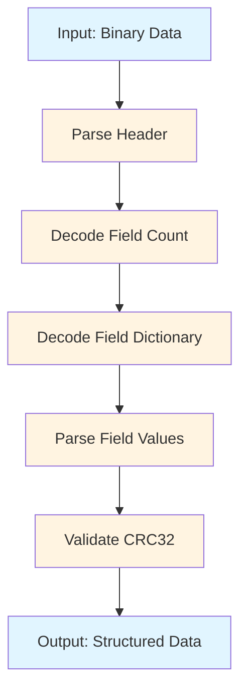
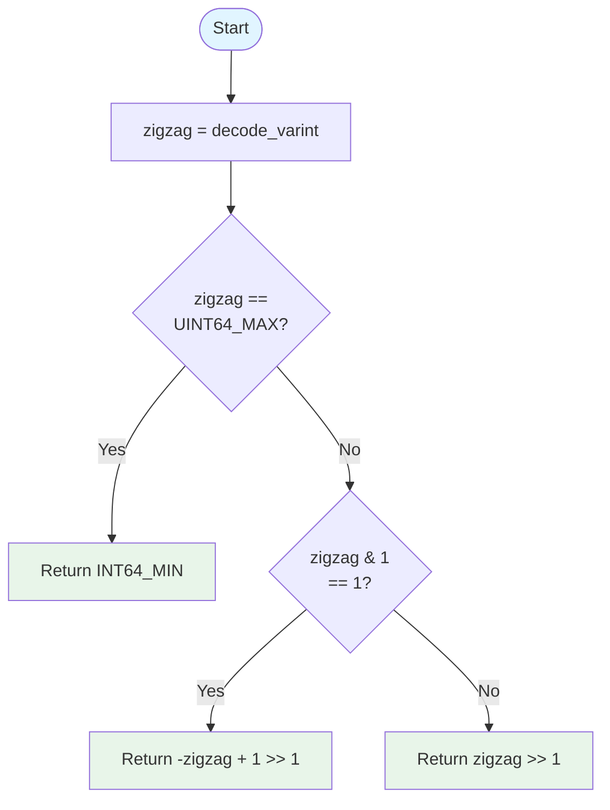

# BlazeBinary

## Cross-Language Decoder Implementation Guide

_Last updated: February 2025_

This document provides guidance for implementing BlazeBinary decoders in other programming languages. This is **future work**—the format is designed to be language-agnostic, but reference implementations in other languages are planned for future releases.

## Target Languages

The following languages are planned for BlazeBinary decoder implementations:

- **Rust**: High-performance, memory-safe implementation
- **Go**: Simple, efficient implementation with good concurrency support
- **Python**: Easy-to-use implementation for scripting and data processing
- **JavaScript/TypeScript**: Browser and Node.js support

## BlazeBinary Record Structure

A BlazeBinary record consists of:

1. **Header** (optional, for versioning)
2. **Field Dictionary** (varint count + sorted key-value pairs)
3. **Field Values** (type-tagged values)
4. **CRC32** (optional, for integrity checking)

### Record Format

```
[Header?] [FieldCount: varint] [Fields...] [CRC32?]
```

Where each field is encoded as:
- Type tag (implicit from encoding method)
- Value (type-specific encoding)

## Decoding Pipeline



## Core Decoding Operations

### 1. Varint Decoding (LEB128)

Varints use LEB128 (Little-Endian Base 128) encoding:

**Algorithm**:

```mermaid
flowchart TD
    Start([Start]) --> Init[result = 0<br/>shift = 0]
    Init --> Read[Read byte]
    Read --> Extract[result |= byte & 0x7F << shift]
    Extract --> Check{Continuation bit<br/>byte & 0x80 == 0?}
    Check -->|Yes| Return[Return result]
    Check -->|No| Shift[shift += 7]
    Shift --> Overflow{shift >= 64?}
    Overflow -->|Yes| Error[Error: Varint too large]
    Overflow -->|No| Read
    
    style Start fill:#e1f5ff
    style Return fill:#e8f5e9
    style Error fill:#ffebee
```

**Example**: `[0xE5, 0x8E, 0x26]` → `624485`

### 2. Zigzag Decoding

Zigzag encoding maps signed integers to unsigned integers:

**Algorithm**:



**Example**: `1` → `-1`, `2` → `1`, `3` → `-2`

### 3. String Decoding

Strings use UTF-8 with varint length prefix:

**Algorithm**:
```
length = decode_varint()
if length > MAX_STRING_LENGTH:
    error("String too long")
bytes = read_bytes(length)
string = decode_utf8(bytes)
```

**Example**: `[0x05, 0x48, 0x65, 0x6C, 0x6C, 0x6F]` → `"Hello"`

### 4. Fixed-Width Types

**UInt32** (little-endian, 4 bytes):
```
bytes = read_bytes(4)
value = bytes[0] | (bytes[1] << 8) | (bytes[2] << 16) | (bytes[3] << 24)
```

**UInt64** (little-endian, 8 bytes):
```
bytes = read_bytes(8)
value = bytes[0] | (bytes[1] << 8) | ... | (bytes[7] << 56)
```

**Double** (IEEE 754, little-endian, 8 bytes):
```
bytes = read_bytes(8)
bit_pattern = bytes[0] | (bytes[1] << 8) | ... | (bytes[7] << 56)
value = double_from_bit_pattern(bit_pattern)
```

### 5. Array Decoding

Arrays use varint count prefix:

**Algorithm**:
```
count = decode_varint()
if count > MAX_ARRAY_LENGTH:
    error("Array too large")
array = []
for i in 0..count:
    element = decode_value()  // Type-specific decoding
    array.append(element)
```

### 6. Dictionary Decoding

Dictionaries are encoded as sorted key-value pairs:

**Algorithm**:
```
count = decode_varint()
if count > MAX_DICT_LENGTH:
    error("Dictionary too large")
dict = {}
for i in 0..count:
    key = decode_string()
    value = decode_value()  // Type-specific decoding
    dict[key] = value
```

**Note**: Keys are sorted lexicographically in the encoded format for determinism.

## Type Tag System

BlazeBinary uses implicit type tags based on the encoding method. The decoder must track the expected type based on the schema or field dictionary.

**Type Mapping**:
- Varint → `Int` (signed integer)
- UInt32 → `UInt32` (unsigned 32-bit)
- UInt64 → `UInt64` (unsigned 64-bit)
- Bool → `Bool` (0x00 = false, 0x01 = true)
- Double → `Double` (IEEE 754)
- Length-prefixed → `String` or `Data` (determined by context)
- Array count → `Array`
- Dictionary count → `Dictionary`

## Error Handling

Decoders should handle these error conditions:

1. **Truncated Data**: Not enough bytes to complete decoding
2. **Invalid Varint**: Varint exceeds maximum length (10 bytes)
3. **Oversized Field**: Field length exceeds `maxAllowedLength` (default: 10 MB)
4. **Invalid UTF-8**: String contains invalid UTF-8 sequences
5. **Invalid Bool**: Bool value is not 0x00 or 0x01
6. **Alignment Issues**: Fixed-width types must be read byte-by-byte (no direct memory loads)

## Implementation Checklist

For each target language, implement:

- [ ] Varint decoding (LEB128)
- [ ] Zigzag decoding
- [ ] String decoding (UTF-8)
- [ ] Fixed-width type decoding (UInt32, UInt64, Double)
- [ ] Array decoding
- [ ] Dictionary decoding
- [ ] Optional/null decoding
- [ ] Frame parsing (if implementing network protocol)
- [ ] Error handling
- [ ] Bounds checking
- [ ] Size limit enforcement

## Reference Implementation

The Swift implementation in this repository serves as the reference:

- **Encoder**: `Sources/BlazeBinary/BlazeBinaryEncoder.swift`
- **Decoder**: `Sources/BlazeBinary/BlazeBinaryDecoder.swift`
- **Frame Parser**: `Sources/BlazeBinary/BlazeBinaryFrame.swift`
- **Specification**: `Docs/SPECIFICATION.md`

## Testing

Cross-language decoders should:

1. **Round-trip test**: Encode in Swift, decode in target language (and vice versa)
2. **Edge case tests**: Int.min, Int.max, empty strings, large arrays
3. **Corruption tests**: Truncated data, invalid varints, oversized fields
4. **Determinism tests**: Same input produces same output

## Future Work

This section outlines planned work for cross-language implementations:

### Phase 1: Rust Implementation
- High-performance decoder
- Zero-copy decoding where possible
- Full test suite
- Benchmark comparisons

### Phase 2: Go Implementation
- Simple, idiomatic Go API
- Good concurrency support
- Standard library integration

### Phase 3: Python Implementation
- Easy-to-use API
- NumPy integration for arrays
- JSON conversion utilities

### Phase 4: JavaScript/TypeScript
- Browser and Node.js support
- TypeScript type definitions
- WebAssembly option for performance

## Resources

- [Specification](SPECIFICATION.md) – Complete format specification
- [Encoding Model](ENCODING_MODEL.md) – Encoding strategies and optimizations
- [Architecture](ARCHITECTURE.md) – Implementation structure
- [Swift Reference](https://github.com/Mikedan37/BlazeBinary) – Reference implementation

---

### Related Documents

- [Specification](SPECIFICATION.md)
- [Encoding Model](ENCODING_MODEL.md)
- [Architecture](ARCHITECTURE.md)
- [Rationale](RATIONALE.md)

