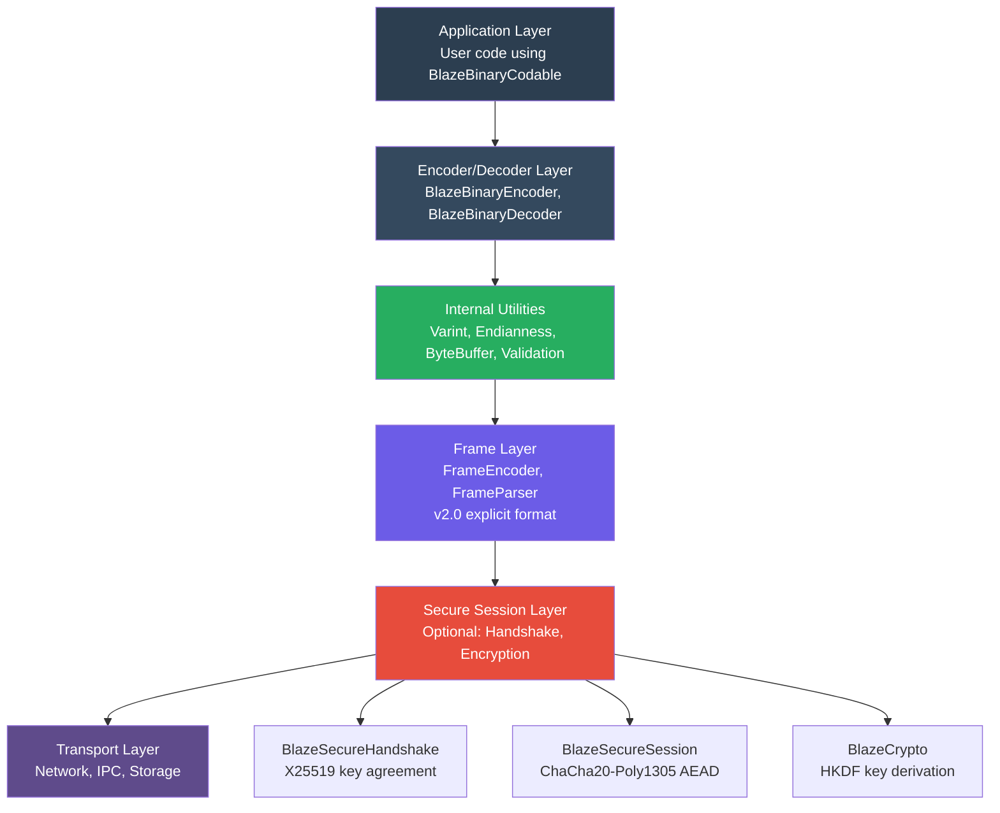
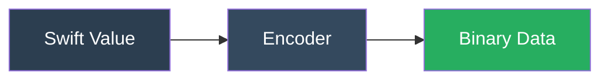
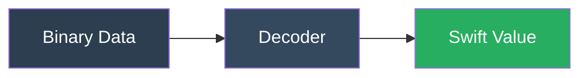
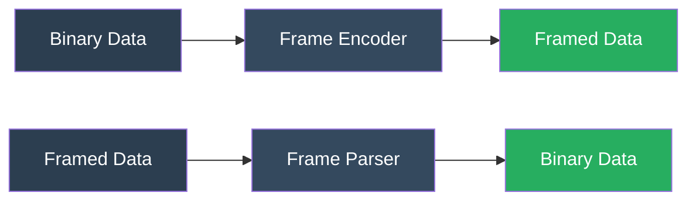
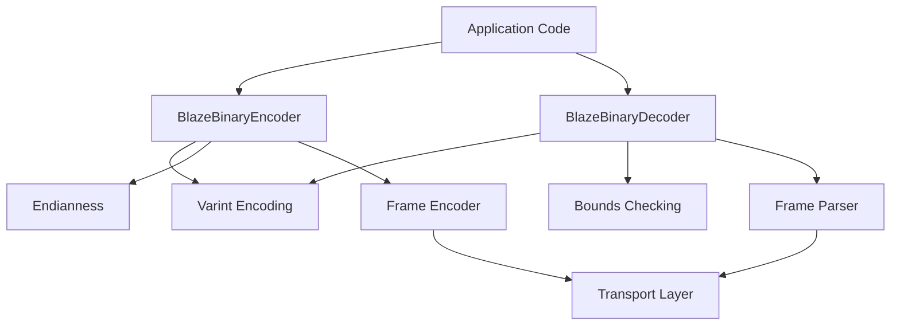
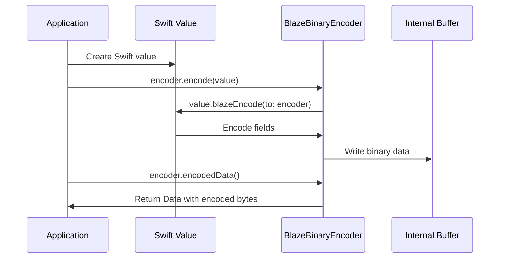
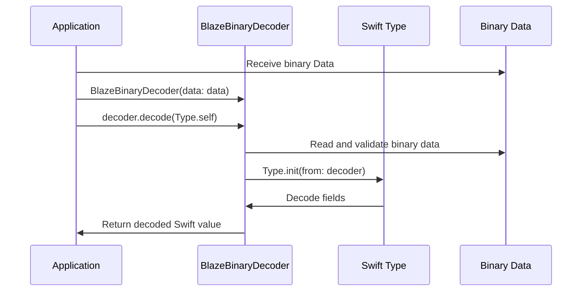
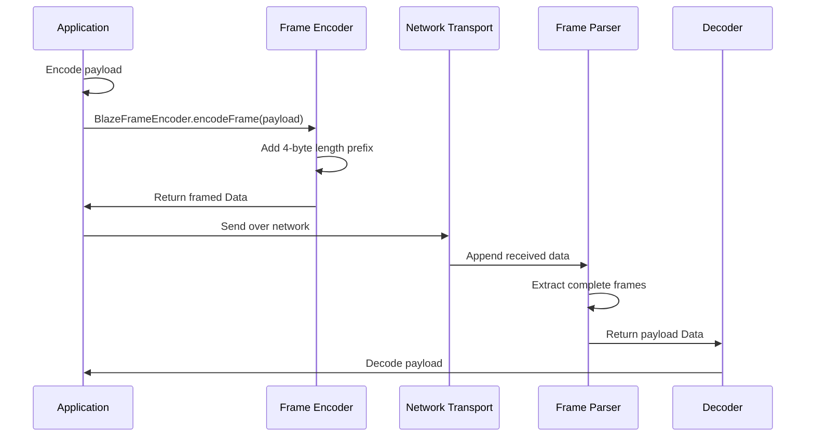

# BlazeBinary

## Architecture

_Last updated: February 2025_

This document describes the architecture of BlazeBinary, including component breakdown, data flow, and design decisions.

## Overview

BlazeBinary is organized into distinct layers:



## Component Breakdown

### 1. Encoder Layer

**Components**:
- `BlazeBinaryEncoder`: Main encoding class
- `BlazeBinaryEncodable`: Protocol for encodable types

**Responsibilities**:
- Convert Swift values to binary format
- Maintain encoding state (buffer)
- Enforce deterministic encoding
- Validate input data

**Data Flow**:



### 2. Decoder Layer

**Components**:
- `BlazeBinaryDecoder`: Main decoding class
- `BlazeBinaryDecodable`: Protocol for decodable types

**Responsibilities**:
- Convert binary data to Swift values
- Validate binary format
- Enforce bounds checking
- Support zero-copy decoding

**Data Flow**:



### 3. Internal Utilities

**Components**:
- Varint encoding/decoding (LEB128)
- Zigzag encoding for signed integers
- Endianness conversion
- Byte buffer management
- Bounds checking

**Responsibilities**:
- Low-level encoding primitives
- Cross-platform compatibility
- Performance optimization
- Safety guarantees

### 4. Frame Layer

**Components**:
- `BlazeFrameEncoder`: Frame encoding
- `BlazeFrameParser`: Incremental frame parsing

**Responsibilities**:
- Add frame boundaries (length prefixes)
- Handle partial frames
- Enforce size limits
- Support streaming protocols

**Data Flow**:



## Module Interactions



## Data Flow

### Encoding Flow



### Decoding Flow



### Frame Flow



## Design Decisions

### 1. Deterministic Encoding

**Decision**: Same input always produces identical bytes

**Rationale**:
- Enables content addressing (hashing)
- Supports testing and verification
- Allows deterministic comparisons

**Implementation**:
- Explicit field ordering
- No non-deterministic behavior
- Consistent encoding algorithms

### 2. Zero-Copy Decoding

**Decision**: Return Data slices when possible

**Rationale**:
- Reduces memory allocation
- Improves performance for large data
- Maintains safety guarantees

**Implementation**:
- Use `Data.subdata(in:)` for slices
- Fallback to copying if needed
- Document zero-copy behavior

### 3. Strict Bounds Checking

**Decision**: Validate all reads before execution

**Rationale**:
- Prevents buffer overflows
- Ensures memory safety
- Provides clear error messages

**Implementation**:
- `ensureBytes(_:)` before every read
- Validate lengths before use
- Fail-fast on errors

### 4. Size Limits

**Decision**: Hard limits on frame and buffer sizes

**Rationale**:
- Prevents resource exhaustion
- Protects against DoS attacks
- Provides predictable behavior

**Implementation**:
- Max frame: 5 MB
- Max buffer: 10 MB
- Max field: 10 MB (configurable)

### 5. Protocol-Based Design

**Decision**: Use Swift protocols for extensibility

**Rationale**:
- Type-safe encoding/decoding
- Compile-time checking
- Easy to extend

**Implementation**:
- `BlazeBinaryEncodable` protocol
- `BlazeBinaryDecodable` protocol
- `BlazeBinaryCodable` typealias

## Overflow Behavior

### Encoder Overflow

- Encoder uses `Data` which grows dynamically
- No explicit size limit (limited by system memory)
- Applications should monitor memory usage

### Decoder Overflow

- Decoder validates all lengths before reading
- Rejects oversized data with clear errors
- Configurable `maxAllowedLength` parameter

### Frame Parser Overflow

- Parser enforces 10 MB buffer limit
- Rejects frames exceeding 5 MB
- Returns errors for oversized data

## Deterministic Sorting Rules

### Dictionary Encoding

Dictionaries are encoded with sorted keys for determinism:

```swift
let sortedKeys = keys.sorted()
for key in sortedKeys {
    encoder.encode(key)
    encoder.encode(dict[key]!)
}
```

### Array Encoding

Arrays preserve order (no sorting):

```swift
for item in array {
    try encoder.encode(item)
}
```

## Cross-Platform Constraints

### Endianness

- **Fixed-width integers**: Little-endian
- **Frame headers**: Big-endian (network byte order)
- **Varints**: Byte-order independent

### Character Encoding

- **Strings**: UTF-8 only
- **Validation**: Invalid UTF-8 rejected

### Floating Point

- **Double**: IEEE 754 double precision
- **Determinism**: Not guaranteed across platforms
- **Recommendation**: Use integers for deterministic encoding

## Performance Characteristics

### Time Complexity

- **Varints**: O(log n) where n is the value
- **Fixed-width**: O(1)
- **Length-prefixed**: O(n) where n is length
- **Arrays**: O(n) where n is count

### Space Complexity

- **Varints**: 1-10 bytes
- **Fixed-width**: Constant (4 or 8 bytes)
- **Length-prefixed**: 1-10 bytes (length) + payload
- **Arrays**: 1-10 bytes (count) + sum of items

### Memory Usage

- **Encoder**: Grows dynamically with encoded data
- **Decoder**: Zero-copy where possible
- **Frame Parser**: Buffers up to 10 MB

## Error Handling

### Error Types

- `BlazeBinaryError.truncated`: Insufficient data
- `BlazeBinaryError.invalidVarint`: Invalid varint encoding
- `BlazeBinaryError.invalidFrameLength`: Invalid frame length
- `BlazeBinaryError.oversizedFrame`: Frame too large
- `BlazeBinaryError.decodeFailed`: Decoding failed

### Error Propagation

- Errors thrown immediately (fail-fast)
- No partial decoding on error
- Clear error messages for debugging

## Testing Strategy

### Unit Tests

- Individual component testing
- Edge case coverage
- Error condition testing

### Integration Tests

- Round-trip encoding/decoding
- Frame protocol testing
- Cross-platform verification

### Property Tests

- Determinism verification
- Round-trip correctness
- Size limit enforcement

---

### Related Documents

- [Specification](SPECIFICATION.md)
- [Encoding Model](ENCODING_MODEL.md)
- [Frame Protocol](FRAME_PROTOCOL.md)
- [Threat Model](THREAT_MODEL.md)
- [Cross-Language Decoder](CROSS_LANGUAGE_DECODER.md)

