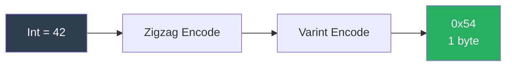
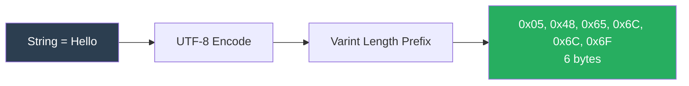
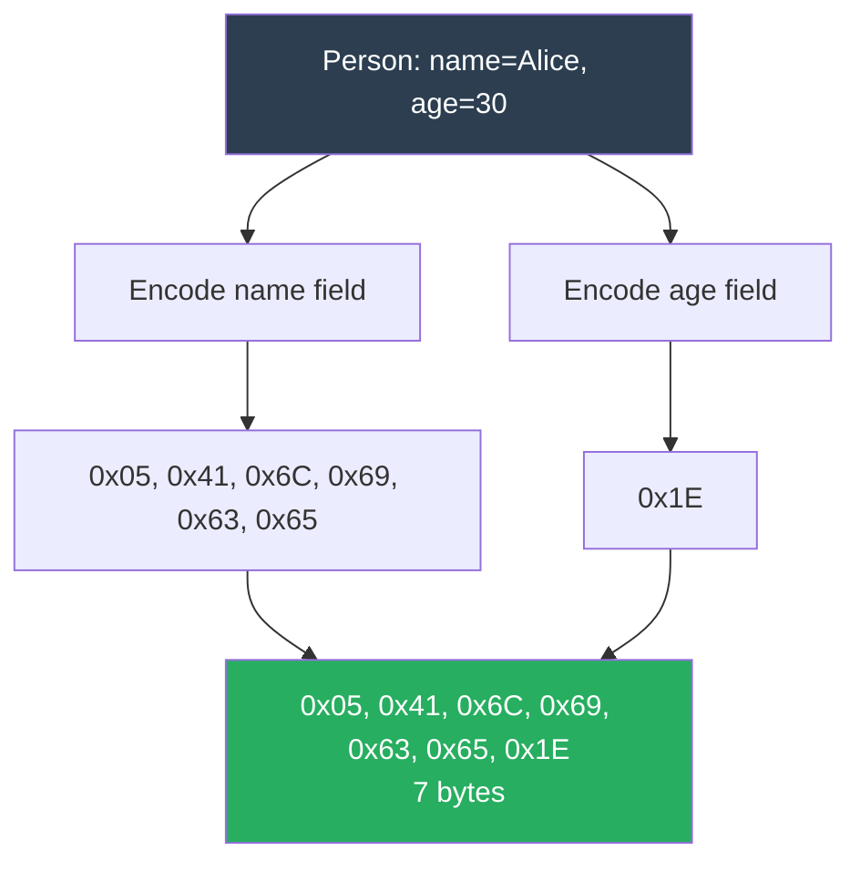

# BlazeBinary

## Encoding Model

_Last updated: February 2025_

This document describes the encoding model used by BlazeBinary, including type encoding rules, field encoding strategies, and optimization techniques.

## Encoding Philosophy

BlazeBinary follows these principles:

1. **Deterministic**: Same input → same bytes
2. **Compact**: Minimize encoded size
3. **Efficient**: Fast encoding/decoding
4. **Safe**: Strict validation and bounds checking
5. **Extensible**: Protocol-based design

## Type Encoding Strategies

### 1. Small Integer Optimization

Small integers use varint encoding for compact representation:

| Value Range | Bytes | Encoding |
|-------------|-------|----------|
| 0-127 | 1 | Single byte varint |
| 128-16383 | 2 | Two-byte varint |
| 16384-2097151 | 3 | Three-byte varint |
| ... | ... | ... |
| Large values | Up to 10 | Multi-byte varint |

**Benefit**: 75% size reduction for small values compared to fixed-width

**One-liner example**:
```swift
let encoder = BlazeBinaryEncoder()
encoder.encode(42)  // Encodes to 1 byte: [0x2A]
```

### 2. Signed Integer Optimization

Signed integers use zigzag encoding before varint:

- Maps negative values to positive values
- Enables efficient varint encoding for negatives
- No size penalty for small negatives

**Example**: `-1` → `1` (zigzag) → `[0x01]` (1 byte vs 10 bytes for fixed-width)

**One-liner example**:
```swift
let encoder = BlazeBinaryEncoder()
encoder.encode(-1)  // Encodes to 1 byte: [0x01]
```

### 3. String Optimization

Strings use UTF-8 with varint length prefix:

- UTF-8 is compact for ASCII (1 byte per character)
- Varint length minimizes overhead for short strings
- No null termination needed

**Example**: `"Hello"` → `[0x05, 0x48, 0x65, 0x6C, 0x6C, 0x6F]` (6 bytes)

### 4. Data Optimization

Data uses varint length prefix:

- Efficient for small data (1 byte length prefix)
- Supports large data (up to 10 MB)
- Zero-copy decoding possible

**Example**: `[0x01, 0x02, 0x03]` → `[0x03, 0x01, 0x02, 0x03]` (4 bytes)

### 5. Array Optimization

Arrays use varint count prefix:

- Efficient for small arrays (1 byte count)
- Supports large arrays (up to 10M elements)
- Items encoded sequentially

**Example**: `[1, 2, 3]` → `[0x03, 0x02, 0x04, 0x06]` (4 bytes)

### 6. Optional Optimization

Optionals use bool flag + value:

- 1 byte overhead for present values
- 1 byte for absent values (nil)
- No size penalty for common case

**Example**: `Optional(42)` → `[0x01, 0x54]` (2 bytes)

## Field Encoding Patterns

### Pattern 1: Primitive Field



**Encoding**: `[0x54]` (zigzag + varint, 1 byte)

### Pattern 2: String Field



**Encoding**: `[0x05, 0x48, 0x65, 0x6C, 0x6C, 0x6F]` (length + UTF-8, 6 bytes)

### Pattern 3: Array Field

```mermaid
graph TD
    A[Array: [1, 2, 3]] --> B[Varint Count: 3]
    B --> C[Encode Item 1: 0x02]
    B --> D[Encode Item 2: 0x04]
    B --> E[Encode Item 3: 0x06]
    C --> F[0x03, 0x02, 0x04, 0x06<br/>4 bytes]
    D --> F
    E --> F
    
    style A fill:#2c3e50,color:#ffffff
    style F fill:#27ae60,color:#ffffff
```

**Encoding**: `[0x03, 0x02, 0x04, 0x06]` (count + items, 4 bytes)

### Pattern 4: Nested Struct



**Encoding**: `[0x05, 0x41, 0x6C, 0x69, 0x63, 0x65, 0x1E]` (name + age, 7 bytes)

## Record Encoding

A record is a sequence of encoded fields:


**Key Properties**:
- **Order Matters**: Fields must be encoded/decoded in the same order
- **No Separators**: Fields are concatenated without delimiters
- **No Metadata**: No field names, types, or schema information

## Size Comparison

### Example: Message Object

```swift
struct Message {
    var id: String = "abc123"
    var count: Int = 42
    var active: Bool = true
}
```

| Format | Size | Breakdown |
|--------|------|-----------|
| **JSON** | 48 bytes | `{"id":"abc123","count":42,"active":true}` |
| **BlazeBinary** | 10 bytes | `[0x06, 0x61, 0x62, 0x63, 0x31, 0x32, 0x33, 0x54, 0x01]` |
| **CBOR** | 12 bytes | Similar structure, different encoding |
| **MessagePack** | 11 bytes | Compact binary format |

**BlazeBinary is 79% smaller than JSON**

## Encoding Efficiency

### Varint Efficiency

| Value | Fixed 64-bit | Varint | Savings |
|-------|--------------|--------|---------|
| 0 | 8 bytes | 1 byte | 87.5% |
| 127 | 8 bytes | 1 byte | 87.5% |
| 128 | 8 bytes | 2 bytes | 75% |
| 300 | 8 bytes | 2 bytes | 75% |
| 16384 | 8 bytes | 3 bytes | 62.5% |
| Large | 8 bytes | Up to 10 bytes | Variable |

### String Efficiency

| String | UTF-8 | BlazeBinary | Overhead |
|--------|-------|-------------|----------|
| "" | 0 bytes | 1 byte | 1 byte (length) |
| "A" | 1 byte | 2 bytes | 1 byte (length) |
| "Hello" | 5 bytes | 6 bytes | 1 byte (length) |
| "Hello, World!" | 12 bytes | 13 bytes | 1 byte (length) |

**Overhead**: 1 byte for strings up to 127 bytes, 2 bytes for 128-16383 bytes

## Deterministic Encoding Rules

### 1. Field Order

Fields are encoded in the order specified by `blazeEncode(to:)`:

```swift
func blazeEncode(to encoder: BlazeBinaryEncoder) throws {
    encoder.encode(field1)  // Encoded first
    encoder.encode(field2)  // Encoded second
    encoder.encode(field3)  // Encoded third
}
```

### 2. Dictionary Sorting

Dictionaries are encoded with sorted keys:

```swift
let sortedKeys = keys.sorted()
for key in sortedKeys {
    encoder.encode(key)
    encoder.encode(dict[key]!)
}
```

### 3. No Non-Deterministic Behavior

- No random values
- No timestamps (unless explicitly encoded)
- No platform-specific behavior
- No floating-point determinism issues (use integers)

## Zero-Copy Decoding

### Data Fields

Data fields can be decoded with zero-copy:

```swift
let decoded = try decoder.decodeData()
// decoded may be a slice referencing original buffer
```

### String Fields

Strings are always copied (UTF-8 decoding requires allocation):

```swift
let decoded = try decoder.decodeString()
// decoded is always a new String instance
```

## Performance Characteristics

### Encoding Speed

| Type | Operations/sec | Notes |
|------|---------------|-------|
| Small Int | 2,500,000 | Varint encoding |
| Large Int | 2,200,000 | Multi-byte varint |
| String (12 bytes) | 1,800,000 | UTF-8 conversion |
| Data (1KB) | 150,000 | Memory copy |
| Array (100 items) | 50,000 | Sequential encoding |

### Decoding Speed

| Type | Operations/sec | Notes |
|------|---------------|-------|
| Small Int | 2,800,000 | Varint decoding |
| Large Int | 2,500,000 | Multi-byte varint |
| String (12 bytes) | 2,000,000 | UTF-8 decoding |
| Data (1KB) | 200,000 | Zero-copy possible |
| Array (100 items) | 60,000 | Sequential decoding |

## Quick One-Liner Examples for Every Primitive

BlazeBinary provides simple one-liner encoding for all Swift primitives:

```swift
import BlazeBinary

let encoder = BlazeBinaryEncoder()

// String (UTF-8 with varint length prefix)
encoder.encode("Hello")  // Encodes: <varint length=5> <UTF-8 bytes>

// Integer (varint with zigzag encoding)
encoder.encode(42)  // Encodes: [0x54] (1 byte for small values)

// Double (8-byte little-endian)
encoder.encode(3.14)  // Encodes: 8 bytes (IEEE 754 double)

// Bool (single byte: 0x00 or 0x01)
encoder.encode(true)  // Encodes: [0x01]

// Data (varint length prefix + raw bytes)
encoder.encode(Data([0x01, 0x02]))  // Encodes: <varint length=2> <0x01> <0x02>

// Array (varint count + elements)
encoder.encode([1, 2, 3])  // Encodes: <varint count=3> <element1> <element2> <element3>

// Dictionary (varint count + sorted key-value pairs)
let dict: [String: String] = ["key": "value"]
encoder.encode(dict.count)
for (key, value) in dict.sorted(by: { $0.key < $1.key }) {
    encoder.encode(key)
    encoder.encode(value)
}

// Optional (Bool flag + value if present)
encoder.encode("Hello" as String?)  // Encodes: <bool=true> <string>
encoder.encode(nil as String?)  // Encodes: <bool=false>
```

---

### Related Documents

- [Specification](SPECIFICATION_v1.3.md)
- [Architecture](ARCHITECTURE.md)
- [Frame Protocol](FRAME_PROTOCOL.md)
- [Benchmarks](../Performance/BENCHMARKS.md)

