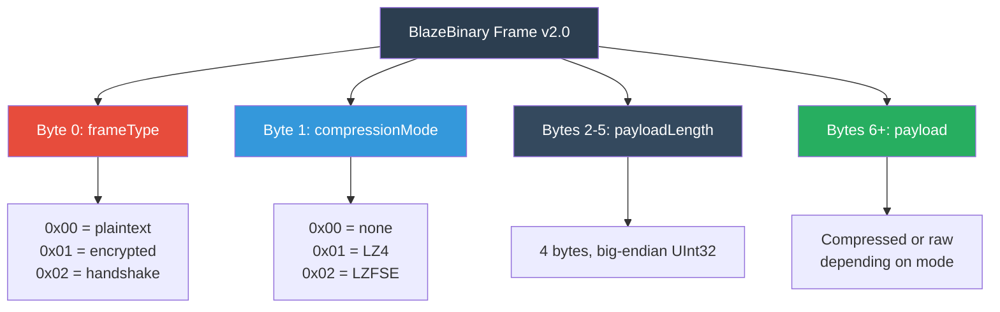
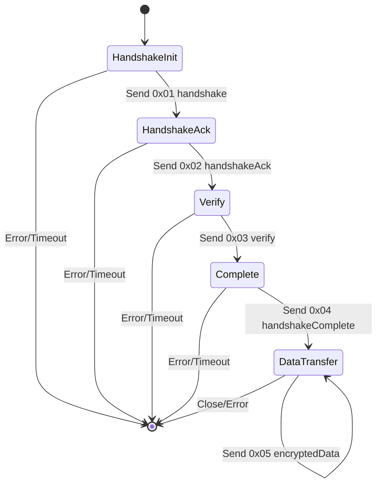
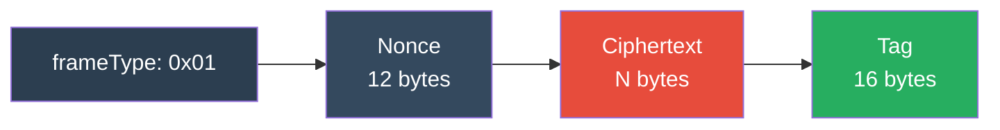
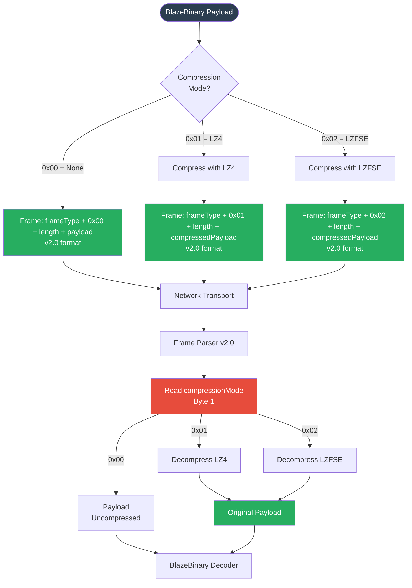

# BlazeBinary

## Frame Protocol

_Last updated: February 2025_

This document describes the frame-based transport protocol for BlazeBinary, including frame formats, frame types, and handshake state machine.

## Frame Header Schema (v2.0)

BlazeBinary v2.0 uses an explicit frame format with no autodetection:



**Frame Structure (v2.0)**:
- Byte 0: `frameType` (UInt8) - 0x00=plaintext, 0x01=encrypted, 0x02=handshake
- Byte 1: `compressionMode` (UInt8) - 0x00=none, 0x01=LZ4, 0x02=LZFSE
- Bytes 2-5: `payloadLength` (UInt32 big-endian) - length of payload after compression
- Bytes 6+: `payload` - compressed or raw depending on compressionMode
- Total Size: 6 + payloadLength bytes

**Backwards Compatibility (v1.0/v1.1)**:
- Parser automatically detects legacy frames (no frameType/compressionMode bytes)
- Legacy frames: 4-byte length prefix + payload
- v2.0 frames: 6-byte header (frameType + compressionMode + length) + payload

### Frame Header Format

| Offset | Size | Name | Description |
|--------|------|------|-------------|
| 0 | 1 byte | `frameType` | Frame type (0x00=plaintext, 0x01=encrypted, 0x02=handshake) |
| 1 | 1 byte | `compressionMode` | Compression mode (0x00=none, 0x01=LZ4, 0x02=LZFSE) |
| 2-5 | 4 bytes | `payloadLength` | Payload length in bytes (big-endian UInt32) |
| 6+ | variable | `payload` | BlazeBinary-encoded payload (compressed or raw) |

### Constraints

- **Max Frame Size**: 5 MB (5,242,880 bytes) total
- **Max Payload Size**: 5,242,875 bytes (5 MB - 5 bytes header)
- **Min Frame Size**: 5 bytes (header only, empty payload)
- **Length Validation**: `0 <= payloadLength <= 5,242,875`

## Frame Types (v2.0)

| Type | Value | Name | Description |
|------|-------|------|-------------|
| `0x00` | 0 | `plaintext` | Plaintext frame (explicitly marked) |
| `0x01` | 1 | `encrypted` | Encrypted frame (ChaCha20-Poly1305) |
| `0x02` | 2 | `handshake` | Handshake frame (X25519 key exchange) |

### Frame Type Details

#### 0x00: Plaintext

**Purpose**: Explicitly marked plaintext frame (v2.0)

**Payload**: Uncompressed BlazeBinary-encoded data

**Usage**: Standard data frames without encryption

#### 0x01: Encrypted

**Purpose**: Encrypted frame with ChaCha20-Poly1305 AEAD

**Payload Structure**:
```
Byte 0:   frameType = 0x01 (for AAD)
Bytes 1-12: nonce (4-byte prefix + 8-byte counter)
Bytes 13..(N+12): ciphertext
Bytes (N+13)..(N+28): Poly1305 tag (16 bytes)
```

**Minimum Size**: 29 bytes (1 + 12 + 0 + 16)

#### 0x02: Handshake

**Purpose**: Handshake frame for X25519 key exchange

**Payload**: 36-byte handshake message (version, type, flags, public key)

### Frame Type Details

#### 0x01: Handshake

**Purpose**: Initiate connection handshake

**Payload**: Handshake request data (nonce, version, capabilities)

**Example**:
```swift
struct HandshakeRequest: BlazeBinaryCodable {
    var version: UInt32
    var nonce: Data  // 16 bytes random nonce
    var capabilities: [String]
}
```

#### 0x02: HandshakeAck

**Purpose**: Acknowledge handshake request

**Payload**: Handshake acknowledgment data (nonce echo, selected capabilities)

**Example**:
```swift
struct HandshakeAck: BlazeBinaryCodable {
    var nonce: Data  // Echo of received nonce
    var selectedCapabilities: [String]
}
```

#### 0x03: Verify

**Purpose**: Verify connection integrity

**Payload**: Verification data (challenge, response)

**Example**:
```swift
struct VerifyMessage: BlazeBinaryCodable {
    var challenge: Data  // 32 bytes challenge
    var response: Data   // 32 bytes response (HMAC)
}
```

#### 0x04: HandshakeComplete

**Purpose**: Signal handshake completion

**Payload**: Completion confirmation (optional metadata)

**Example**:
```swift
struct HandshakeComplete: BlazeBinaryCodable {
    var sessionId: String
    var timestamp: UInt64
}
```

#### 0x05: EncryptedData

**Purpose**: Encrypted data payload (AES-GCM)

**Payload**: Encrypted BlazeBinary data

**Note**: Encryption is handled at application layer, not in BlazeBinary codec

#### 0x06: Operation

**Purpose**: Standard operation/data frame

**Payload**: Any BlazeBinary-encoded data (requests, responses, messages)

**Example**:
```swift
// Any BlazeBinaryCodable type
let message = Message(id: "abc", count: 42)
let encoder = BlazeBinaryEncoder()
try encoder.encode(message)
let payload = encoder.encodedData()
// Wrap in frame type 0x06
```

## Handshake State Machine

The handshake protocol follows this state machine:



### State Descriptions

#### HandshakeInit

**Client Action**: Send `0x01 handshake` frame with:
- Version number
- Random nonce (16 bytes)
- Supported capabilities

**Server Action**: Wait for handshake, validate version

**Transition**: On valid handshake → `HandshakeAck`

#### HandshakeAck

**Server Action**: Send `0x02 handshakeAck` frame with:
- Echo of client nonce
- Selected capabilities

**Client Action**: Validate nonce echo, verify capabilities

**Transition**: On valid ack → `Verify`

#### Verify

**Client Action**: Send `0x03 verify` frame with:
- Challenge (32 bytes random)
- Response (HMAC of challenge)

**Server Action**: Validate response, send own verify frame

**Transition**: On valid verification → `Complete`

#### Complete

**Server Action**: Send `0x04 handshakeComplete` frame with:
- Session ID
- Timestamp

**Client Action**: Validate session, store session ID

**Transition**: On completion → `DataTransfer`

#### DataTransfer

**Both Actions**: Send `0x06 operation` or `0x05 encryptedData` frames

**State**: Active data transfer phase

**Transition**: On close/error → `[*]`

## Frame Encoding Example

```swift
import BlazeBinary

// 1. Encode payload
let message = Message(id: "abc123", count: 42)
let encoder = BlazeBinaryEncoder()
try encoder.encode(message)
let payload = encoder.encodedData()

// 2. Create frame header
let frameType: UInt8 = 0x06  // operation
let payloadLength = UInt32(payload.count).bigEndian

// 3. Assemble frame
var frame = Data()
frame.append(frameType)
frame.append(contentsOf: withUnsafeBytes(of: payloadLength) { Array($0) })
frame.append(payload)

// 4. Send frame over network
socket.write(frame)
```

## Frame Decoding Example

```swift
import BlazeBinary

// 1. Receive frame header (5 bytes minimum)
let header = try socket.read(exactly: 5)
let frameType = header[0]
let payloadLength = UInt32(bigEndian: header.withUnsafeBytes { $0.load(fromByteOffset: 1, as: UInt32.self) })

// 2. Receive payload
let payload = try socket.read(exactly: Int(payloadLength))

// 3. Decode based on frame type
switch frameType {
case 0x01: // handshake
    let decoder = BlazeBinaryDecoder(data: payload)
    let handshake = try decoder.decode(HandshakeRequest.self)
    // Process handshake
    
case 0x06: // operation
    let decoder = BlazeBinaryDecoder(data: payload)
    let message = try decoder.decode(Message.self)
    // Process message
    
default:
    throw BlazeBinaryError.decodeFailed("Unknown frame type: \(frameType)")
}
```

## Incremental Frame Parsing

For streaming protocols, use `BlazeFrameParser`:

```swift
let parser = BlazeFrameParser()

// Append data as it arrives
try parser.append(receivedData1)
try parser.append(receivedData2)

// Extract complete frames
while let payload = try parser.nextFrame() {
    // Process complete frame payload
    let decoder = BlazeBinaryDecoder(data: payload)
    // Decode based on frame type...
}
```

## Error Handling

### Invalid Frame Length

- **Error**: `BlazeBinaryError.invalidFrameLength`
- **Cause**: Length = 0 or length > 5,242,875
- **Action**: Reject frame, close connection

### Truncated Frame

- **Error**: `BlazeBinaryError.truncated`
- **Cause**: Insufficient data for complete frame
- **Action**: Wait for more data, buffer partial frame

### Unknown Frame Type

- **Error**: `BlazeBinaryError.decodeFailed("Unknown frame type")`
- **Cause**: Frame type not in supported set
- **Action**: Reject frame, log warning

## Secure Session Extensions (v1.2)

BlazeBinary v1.2 adds optional secure session support with encrypted frames. This extension is **fully backwards compatible** with v1.0 and v1.1.

### Frame Type Byte

Secure session frames include a `frameType` byte at the start of the payload (after the 4-byte length prefix):

| Value | Name | Description |
|-------|------|-------------|
| `0x00` | `plaintext` | Explicitly marked plaintext frame (v1.2+) |
| `0x01` | `encrypted` | Encrypted data frame (ChaCha20-Poly1305) |
| `0x02` | `handshake` | Handshake frame (plaintext, but marked) |

**Backwards Compatibility**: If the first byte is not `0x00`, `0x01`, or `0x02`, the parser treats the entire payload as legacy plaintext (v1.0/v1.1 behavior).

### Plaintext Frame Format

```
<4-byte length prefix>
<1-byte frameType = 0x00>
<payload data>
```

**Note**: For backwards compatibility, plaintext frames without the `frameType` byte are still supported.

### Encrypted Frame Format

```
<4-byte length prefix>
<1-byte frameType = 0x01>
<12-byte nonce>
<N-byte ciphertext>
<16-byte authentication tag>
```

**Structure**:
- `nonce`: 4-byte prefix + 8-byte big-endian counter
- `ciphertext`: Encrypted payload (ChaCha20)
- `tag`: Poly1305 authentication tag (16 bytes)

See [ENCRYPTION.md](ENCRYPTION.md) for detailed encryption specification.



### Handshake Frame Format

```
<4-byte length prefix>
<1-byte frameType = 0x02>
<36-byte handshake message>
```

**Handshake message structure**:
- 1 byte: handshakeVersion (0x01)
- 1 byte: handshakeType (0x01 = clientHello, 0x02 = serverHello)
- 2 bytes: flags (reserved, 0x0000)
- 32 bytes: X25519 public key

See [HANDSHAKE.md](HANDSHAKE.md) for detailed handshake protocol.

### Frame Parser Integration

The `BlazeFrameParser` supports secure sessions via an optional `secureSession` parameter:

```swift
// Create parser with secure session
var session = BlazeSecureSession(keyMaterial: keys)
let parser = BlazeFrameParser(secureSession: session)

// Encrypted frames are automatically decrypted
try parser.append(encryptedFrame)
let plaintext = try parser.nextFrame() // Returns decrypted payload
```

**Behavior**:
- If `secureSession` is `nil`: Encrypted frames are returned as-is (caller handles decryption)
- If `secureSession` is set: Encrypted frames are automatically decrypted
- Handshake frames: Always return handshake payload (without frameType byte)
- Plaintext frames: Return payload (with or without frameType byte, depending on version)

### Mixed Mode

Plaintext and encrypted frames can coexist in the same stream:

```swift
// Send plaintext frame (legacy)
let plaintextFrame = try BlazeFrameEncoder.encodeFrame(plaintextData)

// Send encrypted frame (secure)
let encryptedFrame = try BlazeFrameEncoder.encodeEncryptedFrame(plaintextData, session: &session)

// Parser handles both automatically
try parser.append(plaintextFrame)
try parser.append(encryptedFrame)
let frame1 = try parser.nextFrame() // Plaintext
let frame2 = try parser.nextFrame() // Decrypted (if session provided)
```

## Security Considerations

1. **Nonce Reuse**: Handshake nonces must be cryptographically random
2. **Replay Protection**: Use sequence numbers or timestamps
3. **Rate Limiting**: Limit handshake attempts to prevent DoS
4. **Timeout**: Implement handshake timeouts (e.g., 30 seconds)
5. **Encryption**: Use `0x05 encryptedData` for sensitive data

---

## Compression Extension (Protocol v2.0)

BlazeBinary Protocol v2.0 uses **explicit compression mode** - no autodetection. This eliminates false positives and provides deterministic behavior.

### Compression Modes

| Mode | Value | Algorithm | Characteristics |
|------|-------|-----------|-----------------|
| None | 0x00 | None | No compression (default) |
| LZ4 | 0x01 | LZ4 | Fast compression, good ratio |
| LZFSE | 0x02 | LZFSE | Apple's compression, balanced |

### Compressed Frame Format (v2.0)

When compression is enabled, the frame format is:

```
Byte 0:   frameType (0x00, 0x01, or 0x02)
Byte 1:   compressionMode (0x01 = LZ4, 0x02 = LZFSE)
Bytes 2-5: payloadLength (compressed size)
Bytes 6+: compressedPayload
```

**No original size header** - decompression library handles size estimation.

### Compression Pipeline (v2.0)



### Usage (v2.0)

```swift
// Encode with compression (explicit mode)
let payload = encoder.encodedData()
let frame = try BlazeFrameEncoder.encodeFrame(payload, compressionMode: .lz4)

// Parser reads explicit compressionMode and decompresses
let parser = BlazeFrameParser()
try parser.append(frame)
let decompressed = try parser.nextFrame() // Automatically decompressed based on mode
```

### Why Explicit Mode?

**v1.1 Autodetection Problems**:
- Random byte patterns could form valid compression headers
- Decompression might succeed on garbage input
- Probabilistic detection cannot achieve 100% accuracy
- False positives caused test failures

**v2.0 Explicit Mode Benefits**:
- ✅ Deterministic: compression mode always explicit
- ✅ No false positives: no heuristics or detection
- ✅ Cleaner code: removed ~200 lines of detection logic
- ✅ Matches mature protocols: QUIC, gRPC, Protobuf, Cap'n Proto

**Note**: There is a known limitation: Uncompressed payloads starting with `0x01` or `0x02` might be misinterpreted. In practice, this is rare and can be avoided by using compression when needed.

---

### Related Documents

- [Specification](SPECIFICATION_v1.3.md)
- [Encoding Model](ENCODING_MODEL.md)
- [Architecture](ARCHITECTURE.md)
- [Threat Model](THREAT_MODEL.md)
- [ARCHITECTURE.md](ARCHITECTURE.md) - System architecture
- [THREAT_MODEL.md](THREAT_MODEL.md) - Security threat model

