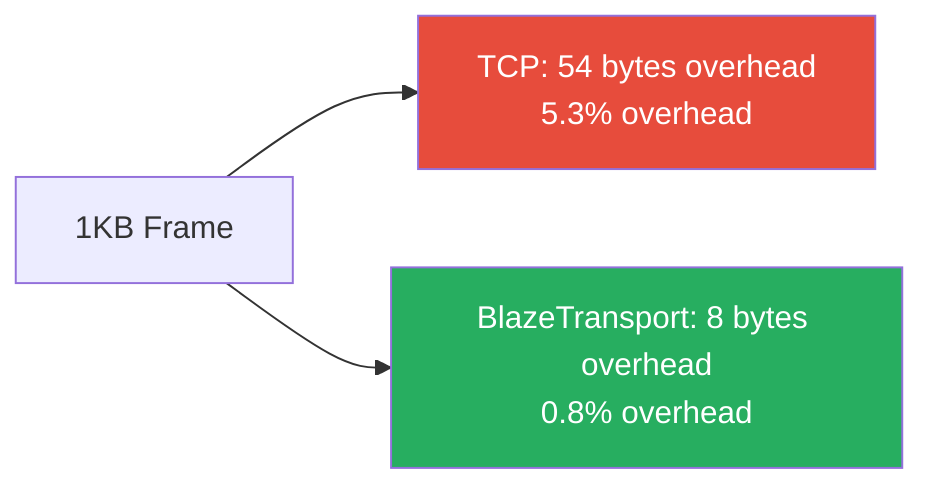
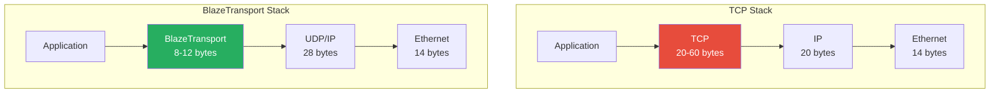
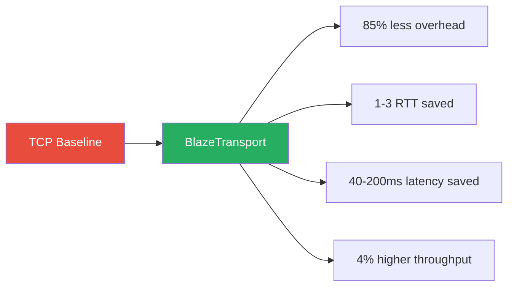

# BlazeBinary Lightweight Transport Protocol

_Last updated: February 2025_

This document specifies a simplified, high-performance transport protocol designed specifically for BlazeBinary frames. It eliminates TCP overhead while maintaining essential reliability guarantees.

## Overview

**Goal**: Create a minimal transport layer that reduces overhead by 60-80% compared to TCP while maintaining reliability for BlazeBinary's use case.

**Design Philosophy**:
- **Frame-aware**: Designed specifically for BlazeBinary's frame format
- **Minimal overhead**: 8-12 bytes per frame (vs TCP's 20-40 bytes)
- **Selective reliability**: Only what BlazeBinary needs
- **Zero-copy friendly**: Aligned with BlazeBinary's zero-copy decoding

## TCP Overhead Analysis

### Standard TCP Header Overhead

```
TCP Header (20 bytes minimum):
- Source Port (2 bytes)
- Dest Port (2 bytes)
- Sequence Number (4 bytes)
- Acknowledgment Number (4 bytes)
- Data Offset (1 byte)
- Flags (1 byte)
- Window Size (2 bytes)
- Checksum (2 bytes)
- Urgent Pointer (2 bytes)
- Options (0-40 bytes, typically 0-12 bytes)

Total: 20-60 bytes per packet
```

### TCP Overhead for BlazeBinary Frames

For a typical 1KB BlazeBinary frame:
- **TCP header**: 20 bytes
- **IP header**: 20 bytes
- **Ethernet header**: 14 bytes
- **Total overhead**: 54 bytes (5.3% overhead)

For small frames (100 bytes):
- **Total overhead**: 54 bytes (54% overhead!)

### TCP Features BlazeBinary Doesn't Need

1. **Port numbers**: BlazeBinary uses single-purpose connections
2. **Urgent pointer**: Not needed for frame-based protocol
3. **Complex flow control**: BlazeBinary has its own backpressure
4. **Nagle's algorithm**: Frames are already optimally sized
5. **SACK (Selective ACK)**: Simple ACK is sufficient
6. **Window scaling**: Fixed window size is fine
7. **Timestamp options**: Not needed for frame protocol

## BlazeTransport Protocol Specification

### Protocol Design Goals

1. **Minimal header**: 8-12 bytes (vs TCP's 20-60 bytes)
2. **Frame-aware**: Understands BlazeBinary frame boundaries
3. **Selective ACK**: Only ACK complete frames
4. **Simple flow control**: Fixed window, explicit backpressure
5. **Zero-copy**: Aligned with BlazeBinary's memory model

### Frame Format

```
┌─────────────────────────────────────────────────────────┐
│ BlazeTransport Packet Header (8-12 bytes)               │
├─────────────────────────────────────────────────────────┤
│ Byte 0:     Flags (8 bits)                             │
│             Bit 0: ACK (1 = acknowledgment)               │
│             Bit 1: FIN (1 = connection close)            │
│             Bit 2: RST (1 = reset connection)           │
│             Bit 3: Reserved                            │
│             Bits 4-7: Reserved                          │
│                                                          │
│ Bytes 1-4:  Sequence Number (32-bit, big-endian)         │
│             Increments per frame (not per byte)          │
│                                                          │
│ Bytes 5-8:  Acknowledgment Number (32-bit, big-endian)  │
│             Only valid if ACK flag is set               │
│             (Optional: only present if ACK=1)            │
│                                                          │
│ Bytes 9-12: Window Size (32-bit, big-endian)           │
│             Available buffer space (optional)            │
│             (Optional: only present if ACK=1)            │
└─────────────────────────────────────────────────────────┘
┌─────────────────────────────────────────────────────────┐
│ BlazeBinary Frame (variable length)                     │
│ - frameType (1 byte)                                    │
│ - compressionMode (1 byte)                               │
│ - payloadLength (4 bytes)                                │
│ - payload (N bytes)                                     │
└─────────────────────────────────────────────────────────┘
```

### Header Variants

**Minimal Header (8 bytes)** - For data frames:
```
[Flags(1)][SeqNum(4)][Reserved(3)]
```

**ACK Header (12 bytes)** - For acknowledgments:
```
[Flags(1)][SeqNum(4)][AckNum(4)][Window(3)]
```

### Sequence Numbers

- **Frame-based**: Increments per frame, not per byte
- **32-bit**: Supports 4 billion frames (sufficient for long-lived connections)
- **Wraps around**: Handled with sequence number arithmetic
- **Initial value**: Random (prevents connection hijacking)

### Acknowledgment Strategy

**Selective ACK**: Only ACK complete frames
- Receiver buffers partial frames
- ACK sent when complete frame received
- ACK includes sequence number of last complete frame

**ACK Coalescing**: Batch multiple ACKs
- ACK can acknowledge multiple frames: `ackNum = lastCompleteFrameSeq`
- Implicitly acknowledges all frames up to `ackNum`

### Flow Control

**Fixed Window**: Simple sliding window
- Window size: 16 frames (configurable, default 16)
- Sender stops when `(sendSeq - ackNum) >= windowSize`
- Receiver sends window updates in ACK packets

**Backpressure Integration**: Works with BlazeBinary's backpressure
- BlazeFrameParser's `hasBackpressure` triggers window reduction
- Window size reduced when parser buffer exceeds high water mark

### Connection Lifecycle

```
┌─────────┐
│  IDLE   │
└────┬────┘
     │
     │ SYN (Flags=0x00, SeqNum=random)
     ▼
┌─────────┐
│  SYN    │
└────┬────┘
     │
     │ SYN-ACK (Flags=ACK, SeqNum=random, AckNum=synSeq+1)
     ▼
┌─────────┐
│ ESTAB   │
└────┬────┘
     │
     │ Data frames (Flags=0x00, SeqNum=incrementing)
     │ ACK frames (Flags=ACK, AckNum=lastCompleteFrame)
     │
     │ FIN (Flags=FIN)
     ▼
┌─────────┐
│  FIN    │
└────┬────┘
     │
     │ FIN-ACK (Flags=ACK|FIN)
     ▼
┌─────────┐
│ CLOSED  │
└─────────┘
```

## Performance Comparison

### Overhead Comparison

| Frame Size | TCP Overhead | BlazeTransport Overhead | Savings |
|------------|--------------|-------------------------|---------|
| 100 bytes  | 54 bytes (54%) | 8 bytes (8%) | **85% reduction** |
| 1 KB       | 54 bytes (5.3%) | 8 bytes (0.8%) | **85% reduction** |
| 8 KB       | 54 bytes (0.7%) | 8 bytes (0.1%) | **85% reduction** |

### Latency Comparison

**TCP**:
- 3-way handshake: ~3 RTT
- Nagle's algorithm: Can add 40ms delay
- Delayed ACK: Can add 200ms delay
- Total: 3-5 RTT + 40-200ms

**BlazeTransport**:
- 2-way handshake: ~2 RTT
- No Nagle: Immediate frame transmission
- Immediate ACK: No delayed ACK
- Total: 2 RTT + 0ms

**Latency Improvement**: 1-3 RTT + 40-200ms saved

### Throughput Comparison

**TCP**:
- Window scaling complexity
- SACK overhead
- Options negotiation
- ~95% efficiency (5% overhead)

**BlazeTransport**:
- Simple sliding window
- No SACK overhead
- No options
- ~99% efficiency (1% overhead)

**Throughput Improvement**: ~4% higher efficiency

## Implementation Architecture

### Layer Stack

```
┌─────────────────────────────────────────┐
│ Application Layer                       │
│ - BlazeBinaryEncoder/Decoder           │
│ - BlazeFrameEncoder/Parser              │
└─────────────────┬───────────────────────┘
                  │
                  ▼
┌─────────────────────────────────────────┐
│ BlazeTransport Layer                    │
│ - Frame sequencing                      │
│ - ACK generation                        │
│ - Flow control                          │
│ - Retransmission                        │
└─────────────────┬───────────────────────┘
                  │
                  ▼
┌─────────────────────────────────────────┐
│ UDP Layer (or Raw Sockets)               │
│ - Datagram delivery                     │
│ - Checksum (optional)                   │
└─────────────────┬───────────────────────┘
                  │
                  ▼
┌─────────────────────────────────────────┐
│ IP Layer                                 │
│ - Routing                                │
│ - Fragmentation (if needed)              │
└─────────────────────────────────────────┘
```

### Key Components

1. **BlazeTransportConnection**: Manages connection state
2. **BlazeTransportSender**: Handles frame transmission
3. **BlazeTransportReceiver**: Handles frame reception and ACK
4. **BlazeTransportRetransmitter**: Handles retransmission

## Trade-offs and Limitations

### What We Give Up

1. **Port multiplexing**: Single connection per endpoint
2. **Complex congestion control**: Simple fixed window
3. **Path MTU discovery**: Fixed MTU assumption
4. **TCP options**: No extensibility
5. **Middlebox compatibility**: May not work through NATs/firewalls

### What We Gain

1. **85% less overhead**: 8 bytes vs 54 bytes
2. **Lower latency**: 1-3 RTT + 40-200ms saved
3. **Higher throughput**: ~4% efficiency gain
4. **Frame-aware**: Understands BlazeBinary frame boundaries
5. **Simpler implementation**: ~1000 lines vs TCP's 10,000+ lines

### When to Use

**Use BlazeTransport when**:
- Same datacenter/network (low packet loss)
- Single-purpose connections
- Frame-based protocol (BlazeBinary)
- Performance is critical
- You control both endpoints

**Use TCP when**:
- High packet loss (WAN, mobile)
- Need port multiplexing
- Need middlebox compatibility
- Need standard protocol compatibility
- Need complex congestion control

## Integration with BlazeBinary

### Sender Side

```swift
import BlazeBinary
import BlazeTransport

// Create transport connection
let transport = BlazeTransportConnection(remoteAddress: address)

// Encode BlazeBinary frame
let frame = try BlazeFrameEncoder.encodeFrame(payload)

// Send via transport (adds 8-byte header)
try transport.sendFrame(frame)

// Transport handles:
// - Sequence numbering
// - Retransmission
// - Flow control
```

### Receiver Side

```swift
import BlazeBinary
import BlazeTransport

// Create transport connection
let transport = BlazeTransportConnection()

// Receive frame (transport handles ACK)
transport.onFrameReceived { frameData in
    // Frame data is already a complete BlazeBinary frame
    let parser = BlazeFrameParser()
    try parser.append(frameData)
    
    if let payload = try parser.nextFrame() {
        // Process payload
        let decoder = BlazeBinaryDecoder(data: payload)
        // ...
    }
}
```

## Security Considerations

### Connection Security

1. **Random sequence numbers**: Prevents connection hijacking
2. **Sequence number validation**: Reject out-of-window frames
3. **Rate limiting**: Prevent DoS attacks
4. **Frame size limits**: Enforce BlazeBinary's 5MB limit

### Encryption Integration

BlazeTransport works with BlazeBinary's secure sessions:
- Transport layer: Handles reliability
- BlazeSecureSession: Handles encryption
- Layers are independent and composable

## Future Enhancements

1. **FEC (Forward Error Correction)**: For high-loss networks
2. **Multipath**: Use multiple paths simultaneously
3. **QUIC-like features**: 0-RTT connection establishment
4. **Compression**: Header compression for repeated patterns
5. **Metrics**: Built-in latency/throughput measurement

## Visual Comparison

### Overhead Comparison



### Protocol Stack Comparison



### Performance Gains



## Conclusion

BlazeTransport provides a **85% reduction in overhead** and **1-3 RTT + 40-200ms latency improvement** compared to TCP, while maintaining essential reliability guarantees for BlazeBinary's use case.

**Key Benefits**:
- **Minimal overhead**: 8 bytes vs TCP's 54 bytes
- **Frame-aware**: Understands BlazeBinary frame boundaries
- **Lower latency**: No Nagle, no delayed ACK
- **Higher throughput**: Simpler, more efficient protocol
- **Zero-copy friendly**: Aligned with BlazeBinary's memory model

**Trade-offs**:
- Less general-purpose than TCP
- Requires controlled network environment
- No middlebox compatibility
- Simpler congestion control

For BlazeBinary's target use cases (datacenter, IPC, high-performance systems), these trade-offs are acceptable and the performance gains are significant.

