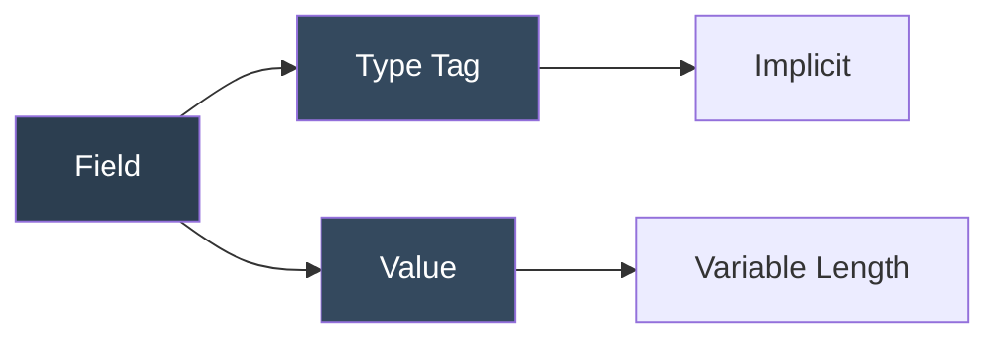
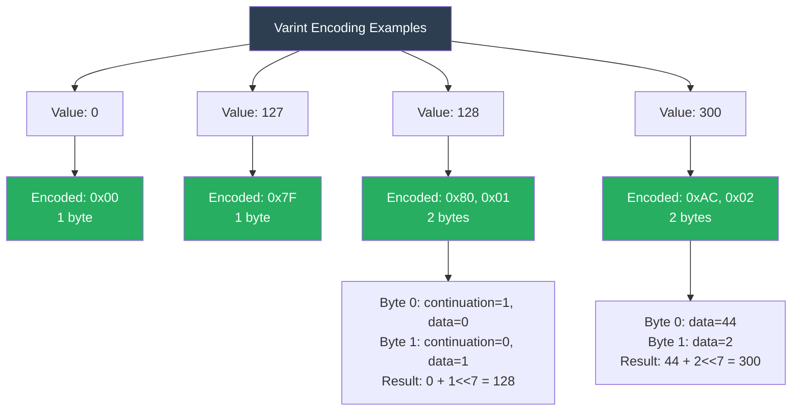
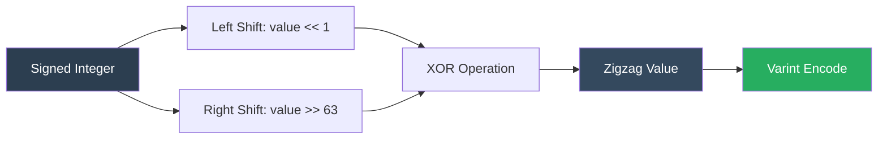
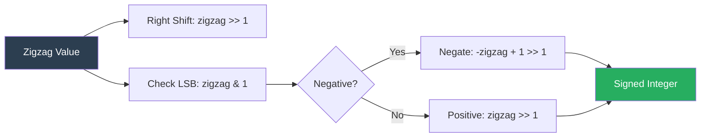
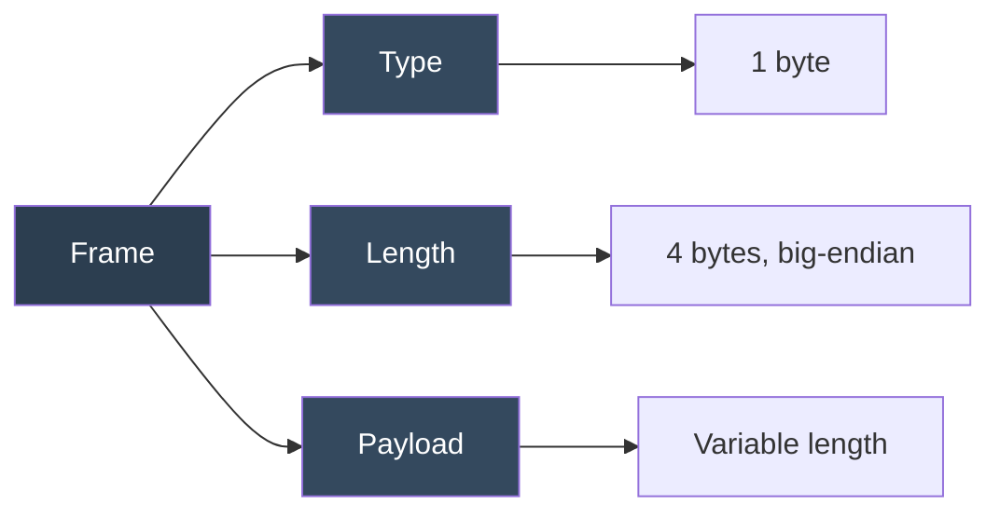

# BlazeBinary

## Specification

_Last updated: February 2025_

## Abstract

BlazeBinary is a deterministic binary encoding format designed for efficient serialization of structured data. It provides compact binary representation, deterministic encoding guarantees, and cross-platform compatibility. This document specifies the encoding format, type system, and protocol semantics.

## 1. Introduction

### 1.1. Purpose

BlazeBinary addresses the need for:
- **Deterministic encoding**: Same input always produces identical bytes
- **Compact representation**: Smaller than JSON, comparable to CBOR/MessagePack
- **Type safety**: Strong typing with validation
- **Cross-platform**: Language-neutral encoding format
- **Performance**: Fast encoding/decoding with zero-copy optimizations

### 1.2. Scope

This specification defines:
- Binary encoding format
- Type system and encoding rules
- Frame protocol for transport
- Error handling semantics
- Cross-platform constraints

**Out of Scope**:
- Network transport protocols (use TLS/SSL)
- Application-level authentication
- Key management
- Compression algorithms

### 1.3. Terminology

- **Record**: A complete BlazeBinary-encoded value
- **Field**: A single encoded value within a record
- **Varint**: Variable-length integer encoding (LEB128)
- **Frame**: Transport-level message boundary
- **Payload**: BlazeBinary-encoded data within a frame
- **Deterministic**: Same input always produces identical output

## 2. Conventions Used in This Document

### 2.1. Normative vs Informative

- **Normative**: Sections marked as "MUST", "SHALL", "REQUIRED", "MUST NOT", "SHALL NOT"
- **Informative**: Sections marked as "SHOULD", "SHOULD NOT", "RECOMMENDED", "MAY", "OPTIONAL"

### 2.2. Byte Order

- **Little-endian**: Used for fixed-width integers (UInt32, UInt64, Double)
- **Big-endian**: Used for frame length prefixes
- **Network byte order**: Big-endian (for frame headers)

### 2.3. Notation

- `0x` prefix: Hexadecimal notation
- `0b` prefix: Binary notation
- `[byte1, byte2, ...]`: Byte array notation
- `<type>`: Type placeholder

## 3. Record Structure

A BlazeBinary record is a sequence of encoded fields. Fields are encoded in order, with no explicit field separators.

### 3.1. Field Encoding

Each field follows this structure:



**Type Tag**: Implicit from encoding method (no explicit tag byte)

**Value**: Encoded according to type rules (see Section 4)

### 3.2. Field Ordering

- Fields MUST be encoded in the order specified by the encoding function
- Fields MUST be decoded in the same order as encoding
- Field order is part of the deterministic encoding guarantee

### 3.3. Schema Versioning (Protocol v1.1)

**Optional Schema Version Field**

BlazeBinary Protocol v1.1 introduces optional schema versioning for forward compatibility:

- **Schema Version 1 (default)**: No schema version marker is encoded (backwards compatible with v1.0)
- **Schema Version > 1**: Schema version is encoded as the first field using a special marker

**Encoding Format**:
- If `schemaVersion == 1`: No marker is encoded (record starts with first field)
- If `schemaVersion > 1`: Record starts with:
  - `0xFE` (schema version marker byte)
  - `varint(schemaVersion)` (LEB128-encoded schema version)
  - Followed by encoded fields

**Decoding**:
- Decoder checks first byte:
  - If `0xFE`: Read varint as schema version, then decode fields
  - Otherwise: Assume schema version 1, first byte is part of first field

**Example**:
```
Schema Version 1 (default):
  [field1] [field2] ...  (no marker)

Schema Version 2:
  [0xFE] [0x02] [field1] [field2] ...  (marker + varint(2) + fields)
```

**Backwards Compatibility**:
- All v1.0 records (no schema version marker) are automatically detected as schema version 1
- v1.1 decoders can read v1.0 records without modification
- v1.0 decoders can read v1.1 records with schema version 1 (no marker)

### 3.4. Record Boundaries

- Records have no explicit length prefix (use frames for transport)
- Records are self-describing (decoder knows structure from type)
- Records can be nested (arrays, structs)

## 4. Field Encoding Rules

### 4.1. Varint Encoding (LEB128)

Varints use LEB128 (Little-Endian Base 128) encoding.

#### 4.1.1. Encoding Algorithm

1. Extract lower 7 bits: `byte = value & 0x7F`
2. If more bits remain: Set continuation bit: `byte |= 0x80`
3. Append byte to output
4. Right-shift value by 7 bits: `value >>= 7`
5. Repeat until `value == 0`

#### 4.1.2. Decoding Algorithm

1. Initialize result: `result = 0`, `shift = 0`
2. Read byte: `byte = input[offset++]`
3. Extract data bits: `result |= (byte & 0x7F) << shift`
4. If continuation bit set (`byte & 0x80 != 0`):
   - Increment shift: `shift += 7`
   - If `shift >= 64`: ERROR (overflow)
   - Repeat from step 2
5. Return result

#### 4.1.3. Constraints

- Maximum 10 bytes for 64-bit values
- Continuation bit MUST be 0 on last byte
- Shift MUST NOT exceed 63 bits

#### 4.1.4. Examples



**Detailed Breakdown**:

- **Value: 0** → `[0x00]` (1 byte)
- **Value: 127** → `[0x7F]` (1 byte)
- **Value: 128** → `[0x80, 0x01]` (2 bytes)
  - Byte 0: `0x80 = 0b10000000` (continuation=1, data=0)
  - Byte 1: `0x01 = 0b00000001` (continuation=0, data=1)
  - Result: `0 + (1 << 7) = 128`
- **Value: 300** → `[0xAC, 0x02]` (2 bytes)
  - Byte 0: `0xAC & 0x7F = 44`
  - Byte 1: `0x02 = 2`
  - Result: `44 + (2 << 7) = 300`

### 4.2. Zigzag Encoding (Signed Integers)

Signed integers use zigzag encoding before varint encoding.

#### 4.2.1. Encoding Formula



**Formula**: `zigzag = (value << 1) ^ (value >> 63)`

Where:
- `<<`: Left shift
- `>>`: Arithmetic right shift (sign extension)
- `^`: XOR operation

#### 4.2.2. Decoding Formula



**Formula**: `value = (zigzag >> 1) ^ (-(zigzag & 1))`

#### 4.2.3. Mapping Table

| Signed | Zigzag | Varint |
|--------|--------|--------|
| 0      | 0      | [0x00] |
| 1      | 2      | [0x02] |
| -1     | 1      | [0x01] |
| 2      | 4      | [0x04] |
| -2     | 3      | [0x03] |

### 4.3. Fixed-Width Encoding

#### 4.3.1. UInt32

- **Size**: 4 bytes
- **Endianness**: Little-endian
- **Format**: `[LSB, byte1, byte2, MSB]`

Example: `0x12345678` → `[0x78, 0x56, 0x34, 0x12]`

#### 4.3.2. UInt64

- **Size**: 8 bytes
- **Endianness**: Little-endian
- **Format**: `[LSB, ..., MSB]`

Example: `0x0123456789ABCDEF` → `[0xEF, 0xCD, 0xAB, 0x89, 0x67, 0x45, 0x23, 0x01]`

#### 4.3.3. Double

- **Size**: 8 bytes
- **Endianness**: Little-endian
- **Format**: IEEE 754 double precision
- **Encoding**: Bit pattern as UInt64, then little-endian

#### 4.3.4. Bool

- **Size**: 1 byte
- **Values**: `0x00` (false), `0x01` (true)
- **Invalid**: Any other value MUST cause decode error

### 4.4. Length-Prefixed Encoding

#### 4.4.1. String

Format: `<varint length> <UTF-8 bytes>`

- Length: Varint encoding of UTF-8 byte count
- Payload: UTF-8 encoded string bytes
- Empty string: Length = 0, no payload bytes

Example: `"Hello"` → `[0x05, 0x48, 0x65, 0x6C, 0x6C, 0x6F]`

#### 4.4.2. Data

Format: `<varint length> <raw bytes>`

- Length: Varint encoding of byte count
- Payload: Raw bytes
- Empty data: Length = 0, no payload bytes

Example: `[0x01, 0x02, 0x03]` → `[0x03, 0x01, 0x02, 0x03]`

### 4.5. Array Encoding

Format: `<varint count> <item1> <item2> ... <itemN>`

- Count: Varint encoding of element count
- Items: Each item encoded according to its type
- Empty array: Count = 0, no items

Example: `[1, 2, 3]` (as Int array) → `[0x03, 0x02, 0x04, 0x06]`

### 4.6. Optional Encoding

Format: `<bool present> <value if present>`

- Present flag: `0x00` (false) or `0x01` (true)
- Value: Encoded only if present = true

Example: `Optional(42)` → `[0x01, 0x54]` (present=true, value=42)

## 5. Type System

### 5.1. Primitive Types

| Type | Encoding | Size |
|------|----------|------|
| `Int` | Zigzag + Varint | 1-10 bytes |
| `UInt32` | Fixed-width little-endian | 4 bytes |
| `UInt64` | Fixed-width little-endian | 8 bytes |
| `Double` | Fixed-width little-endian | 8 bytes |
| `Bool` | Single byte | 1 byte |
| `String` | Varint length + UTF-8 | Variable |
| `Data` | Varint length + bytes | Variable |

### 5.2. Composite Types

| Type | Encoding |
|------|----------|
| `Array<T>` | Varint count + items |
| `Optional<T>` | Bool flag + value |
| `Struct` | Fields in order |
| `Dictionary<K,V>` | Sorted keys + values |

### 5.3. Type Validation

- Decoders MUST validate type constraints
- Invalid encodings MUST be rejected
- Error messages MUST be descriptive

## 6. Checksums

### 6.1. CRC32 (Optional)

CRC32 checksums MAY be added at the application layer for integrity verification.

**Note**: BlazeBinary codec does not include CRC32. Applications should implement CRC32 if needed.

### 6.2. Frame Integrity

Frame headers include length prefixes but no integrity checks. Applications SHOULD use:
- TLS/SSL for transport security
- HMAC for message authentication
- AES-GCM for authenticated encryption

## 7. Frame Protocol

See [FRAME_PROTOCOL.md](FRAME_PROTOCOL.md) for complete frame protocol specification.

### 7.1. Frame Format



### 7.2. Frame Types

- `0x01`: Handshake
- `0x02`: HandshakeAck
- `0x03`: Verify
- `0x04`: HandshakeComplete
- `0x05`: EncryptedData
- `0x06`: Operation

### 7.3. Constraints

- Max frame size: 5 MB
- Max buffer size: 10 MB
- Length validation: `0 < length <= 5,242,875`

## 8. Security Considerations

### 8.1. Input Validation

- All lengths MUST be validated before use
- Bounds checking MUST occur before all reads
- Size limits MUST be enforced

### 8.2. Deterministic Encoding

- Encoding MUST be deterministic (same input → same output)
- No non-deterministic behavior allowed
- Field order MUST be explicit

### 8.3. Resource Limits

- Maximum frame size: 5 MB
- Maximum buffer size: 10 MB
- Maximum field size: 10 MB (configurable)

### 8.4. Transport Security

- Use TLS/SSL for network transport
- Implement authentication at application layer
- Use authenticated encryption for sensitive data

## 9. IANA Considerations

This document has no IANA actions.

## 10. References

### 10.1. Normative References

- [LEB128 Encoding](https://en.wikipedia.org/wiki/LEB128) - Variable-length integer encoding
- [IEEE 754](https://ieee754.org/) - Floating-point arithmetic standard
- [UTF-8](https://tools.ietf.org/html/rfc3629) - UTF-8 encoding standard

### 10.2. Informative References

- [FRAME_PROTOCOL.md](FRAME_PROTOCOL.md) - Frame protocol specification
- [ARCHITECTURE.md](ARCHITECTURE.md) - System architecture
- [../Security/THREAT_MODEL.md](../Security/THREAT_MODEL.md) - Security threat model
- [../Performance/BENCHMARKS.md](../Performance/BENCHMARKS.md) - Performance benchmarks

## Appendix A: Grammar

### A.1. Record Grammar

```
record ::= field+
field  ::= primitive | composite
```

### A.2. Primitive Grammar

```
primitive ::= int | uint32 | uint64 | double | bool | string | data
int       ::= zigzag(varint)
uint32    ::= <4 bytes little-endian>
uint64    ::= <8 bytes little-endian>
double    ::= <8 bytes little-endian IEEE 754>
bool      ::= 0x00 | 0x01
string    ::= varint(length) <UTF-8 bytes>
data      ::= varint(length) <raw bytes>
```

### A.3. Composite Grammar

```
composite ::= array | optional | struct
array     ::= varint(count) item+
optional  ::= bool(present) [value]
struct    ::= field+
```

## Appendix B: Error Types

| Error | Description |
|-------|-------------|
| `truncated` | Insufficient data for complete field |
| `invalidVarint` | Invalid varint encoding |
| `invalidFrameLength` | Invalid frame length prefix |
| `oversizedFrame` | Frame exceeds maximum size |
| `decodeFailed` | Decoding failed with reason |

## Appendix C: Cross-Platform Constraints

### C.1. Endianness

- Fixed-width integers: Little-endian
- Frame headers: Big-endian (network byte order)
- Varints: Byte-order independent

### C.2. Character Encoding

- Strings: UTF-8 only
- Invalid UTF-8: Rejected with error

### C.3. Floating Point

- Double: IEEE 754 double precision
- Platform-specific behavior: Not guaranteed (use integer math for determinism)

---

### Related Documents

- [Encoding Model](ENCODING_MODEL.md)
- [Frame Protocol](FRAME_PROTOCOL.md)
- [Architecture](ARCHITECTURE.md)
- [Threat Model](../Security/THREAT_MODEL.md)
- [Cross-Language Decoder](CROSS_LANGUAGE_DECODER.md)

**Document Status**: This is a draft specification. Feedback and contributions welcome.

