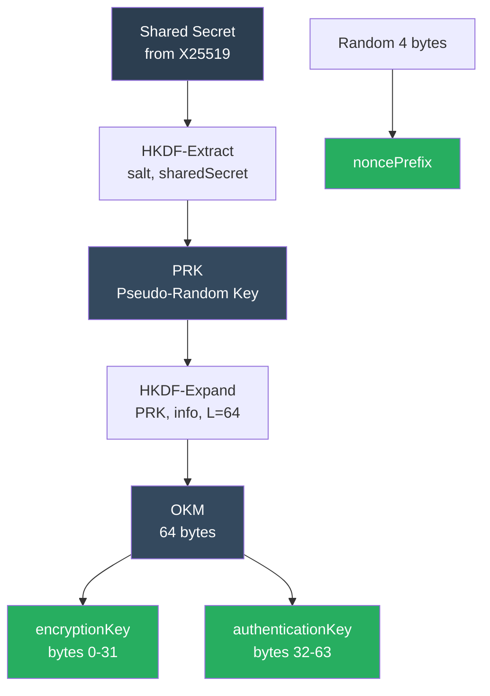
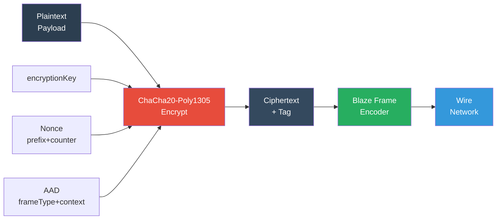

# BlazeBinary

## Encryption & Secure Sessions

_Last updated: February 2025_

This document describes the Secure Session Mode for BlazeBinary, providing authenticated encryption for frame payloads using X25519 key agreement, HKDF key derivation, and ChaCha20-Poly1305 AEAD encryption.

## Overview

Secure Session Mode is an **optional** extension to BlazeBinary that provides:

- **Confidentiality**: Frame payloads are encrypted with ChaCha20-Poly1305
- **Authentication**: Each frame is authenticated with Poly1305 tags
- **Key Agreement**: X25519 Diffie-Hellman establishes shared secrets
- **Key Derivation**: HKDF-SHA256 derives session keys from shared secrets
- **Backwards Compatibility**: Plaintext frames continue to work unchanged

Secure Session Mode is **opt-in**. If you never use the secure session APIs, BlazeBinary behaves exactly as before (v1.0 behavior).

## Algorithms

### Key Agreement: X25519

X25519 is the elliptic curve Diffie-Hellman function over Curve25519, providing:

- **Fast**: Efficient scalar multiplication
- **Small keys**: 32-byte public keys, 32-byte private keys
- **Secure**: 128-bit security level
- **Standard**: RFC 7748

### Key Derivation: HKDF-SHA256

HKDF (HMAC-based Key Derivation Function) with SHA-256 is used to derive session keys:

- **Extract**: PRK = HMAC-SHA256(salt, sharedSecret)
- **Expand**: OKM = HKDF-Expand(PRK, info, L = 64)
- **Split**: encryptionKey = OKM[0..<32], authenticationKey = OKM[32..<64]

### Encryption: ChaCha20-Poly1305

ChaCha20-Poly1305 is an AEAD (Authenticated Encryption with Associated Data) cipher:

- **Stream cipher**: ChaCha20 for encryption
- **MAC**: Poly1305 for authentication
- **Nonce**: 12 bytes (96 bits)
- **Tag**: 16 bytes (128 bits)

## Key Schedule

The key derivation process follows this flow:



### Key Derivation Equations

1. **Extract Phase**:
   ```
   PRK = HMAC-SHA256(salt, sharedSecret)
   ```
   - If `salt` is `nil`, a zero-length salt is used
   - Default: `salt = nil` (zero-length)

2. **Expand Phase**:
   ```
   OKM = HKDF-Expand(PRK, info, L = 64)
   ```
   - `info` = "BlazeBinarySession" (UTF-8 bytes) by default
   - `L` = 64 bytes (32 for encryption + 32 for authentication)

3. **Key Splitting**:
   ```
   encryptionKey = OKM[0..<32]
   authenticationKey = OKM[32..<64]
   ```

4. **Nonce Prefix**:
   ```
   noncePrefix = Random(4 bytes)
   ```
   - Generated using `SecRandomCopyBytes`
   - Combined with counter to form 12-byte nonces

## Nonce Construction

Nonces for ChaCha20-Poly1305 are 12 bytes (96 bits), constructed as:

```
nonce = noncePrefix (4 bytes) || counter (8 bytes, big-endian)
```

- **noncePrefix**: 4 random bytes generated during key derivation
- **counter**: 8-byte big-endian counter, incremented for each frame
- **Separate counters**: `sendCounter` for outbound, `recvCounter` for inbound

### Counter Management

- **Send counter**: Starts at 0, incremented after each encrypted frame
- **Receive counter**: Tracks highest seen counter (for replay detection)
- **No reuse**: Each encrypted frame uses a unique nonce

## AAD (Additional Authenticated Data)

AAD is included in the Poly1305 authentication tag but not encrypted. This ensures:

- Frame type cannot be tampered with
- Context string prevents cross-protocol attacks

AAD format:
```
AAD = frameType (1 byte) || "BlazeBinaryFrame" (UTF-8, 16 bytes)
```

- `frameType = 0x01` for encrypted frames
- Static context string: "BlazeBinaryFrame"

## Encryption Pipeline

The encryption process follows this pipeline:



## Encrypted Frame Format

Encrypted frames have the following structure:

```
<4-byte length prefix (big-endian)>
<1-byte frameType = 0x01>
<12-byte nonce>
<N-byte ciphertext>
<16-byte authentication tag>
```

### Frame Layout

| Offset | Size | Name | Description |
|--------|------|------|-------------|
| 0-3 | 4 bytes | `length` | Total payload length (big-endian UInt32) |
| 4 | 1 byte | `frameType` | `0x01` = encrypted frame |
| 5-16 | 12 bytes | `nonce` | 4-byte prefix + 8-byte counter (big-endian) |
| 17..(N+16) | N bytes | `ciphertext` | Encrypted payload |
| (N+17)..(N+32) | 16 bytes | `tag` | Poly1305 authentication tag |

### Example

For a 100-byte plaintext payload:

```
[Length: 0x0000008D]  // 141 bytes total (1 + 12 + 100 + 16 + 12)
[0x01]                // frameType
[noncePrefix: 4 bytes]
[counter: 8 bytes, big-endian]
[ciphertext: 100 bytes]
[tag: 16 bytes]
```

## Replay Protection

**Current Implementation**: The receive counter tracks the highest seen counter value, but does not actively reject replayed frames. This provides:

- **Detection**: Application can check if counter decreased (replay detected)
- **No automatic rejection**: Allows out-of-order delivery (if needed)

**Future Enhancement**: Optional strict replay protection that rejects nonces with counters <= recvCounter.

**Recommendation**: For strict replay protection, implement application-level sequence number tracking or use the counter values to detect replays.

## Backwards Compatibility

Secure Session Mode is fully backwards compatible:

1. **Plaintext frames**: Continue to work unchanged (no frameType byte required)
2. **Legacy parsers**: Ignore frameType bytes if not recognized
3. **Opt-in**: Only frames created with `encodeEncryptedFrame()` are encrypted
4. **Mixed mode**: Plaintext and encrypted frames can coexist in the same stream

### Frame Type Detection

The parser detects frame types by examining the first byte of the payload:

- `0x00`: Explicitly marked plaintext (v1.2+)
- `0x01`: Encrypted frame (requires `BlazeSecureSession`)
- `0x02`: Handshake frame (plaintext, but marked)
- Other: Legacy plaintext (v1.0/v1.1 compatibility)

## Security Considerations

### Nonce Reuse

**Critical**: Never reuse a nonce with the same key. The implementation ensures:

- Unique nonce prefix per session (random 4 bytes)
- Monotonically increasing counters
- Separate send/recv counters

### Key Management

- **Ephemeral keys**: Each handshake generates new keypairs
- **Perfect forward secrecy**: Old session keys cannot decrypt past sessions
- **Key derivation**: HKDF ensures keys are cryptographically independent

### Authentication

- **AEAD**: ChaCha20-Poly1305 provides authenticated encryption
- **AAD**: Includes frame type and context to prevent cross-protocol attacks
- **Tag verification**: Decryption fails if tag is invalid (tampering detected)

### Side Channels

- **Not hardened**: Current implementation is not specifically hardened against timing/power analysis
- **Recommendation**: For high-security deployments, consider constant-time implementations

## Usage Example

```swift
import BlazeBinary

// 1. Establish handshake
var clientHandshake = BlazeSecureHandshake(role: .client)
let clientHello = clientHandshake.makeClientHello()

// 2. Send clientHello, receive serverHello
var serverHandshake = BlazeSecureHandshake(role: .server)
let serverHello = serverHandshake.makeServerHello()

// 3. Derive session keys
let clientKeys = try clientHandshake.processInboundMessage(serverHello)
let serverKeys = try serverHandshake.processInboundMessage(clientHello)

// 4. Create secure sessions
var clientSession = BlazeSecureSession(keyMaterial: clientKeys)
var serverSession = BlazeSecureSession(keyMaterial: serverKeys)

// 5. Encrypt and send frame
let plaintext = Data("Hello, secure world!".utf8)
let encryptedFrame = try BlazeFrameEncoder.encodeEncryptedFrame(plaintext, session: &clientSession)

// 6. Parse and decrypt frame
let parser = BlazeFrameParser(secureSession: serverSession)
try parser.append(encryptedFrame)
let decrypted = try parser.nextFrame() // Returns decrypted plaintext
```

## Related Documents

- [HANDSHAKE.md](HANDSHAKE.md) - Handshake protocol specification
- [FRAME_PROTOCOL.md](FRAME_PROTOCOL.md) - Frame format and protocol
- [THREAT_MODEL.md](THREAT_MODEL.md) - Security threat model
- [ARCHITECTURE.md](ARCHITECTURE.md) - System architecture
