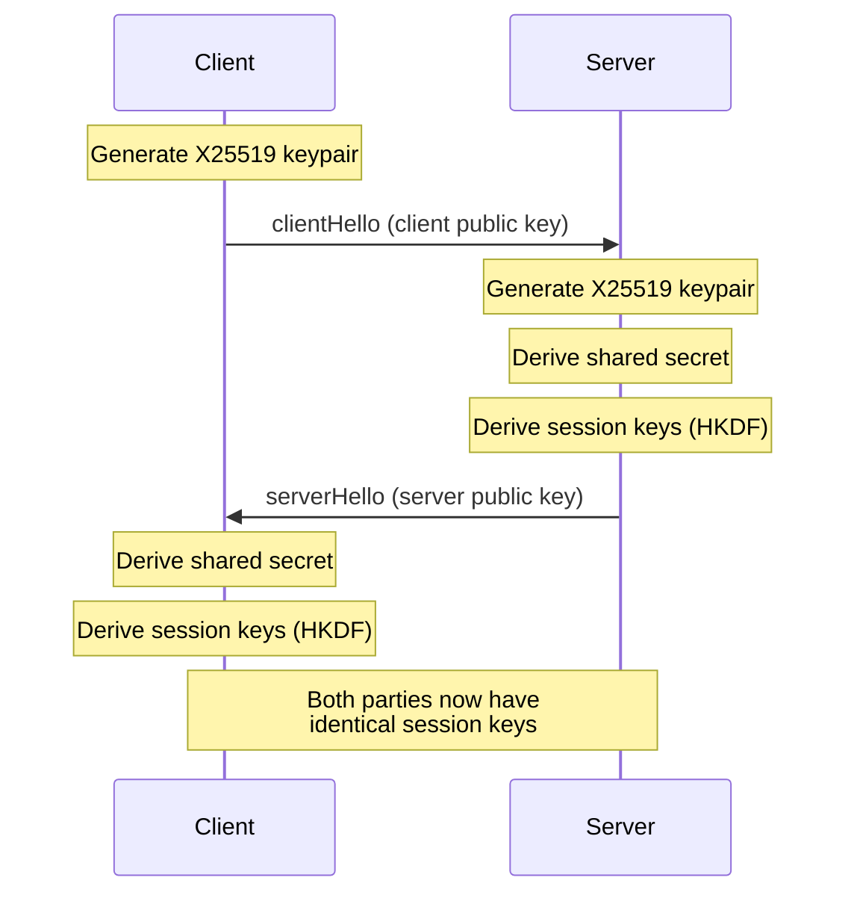
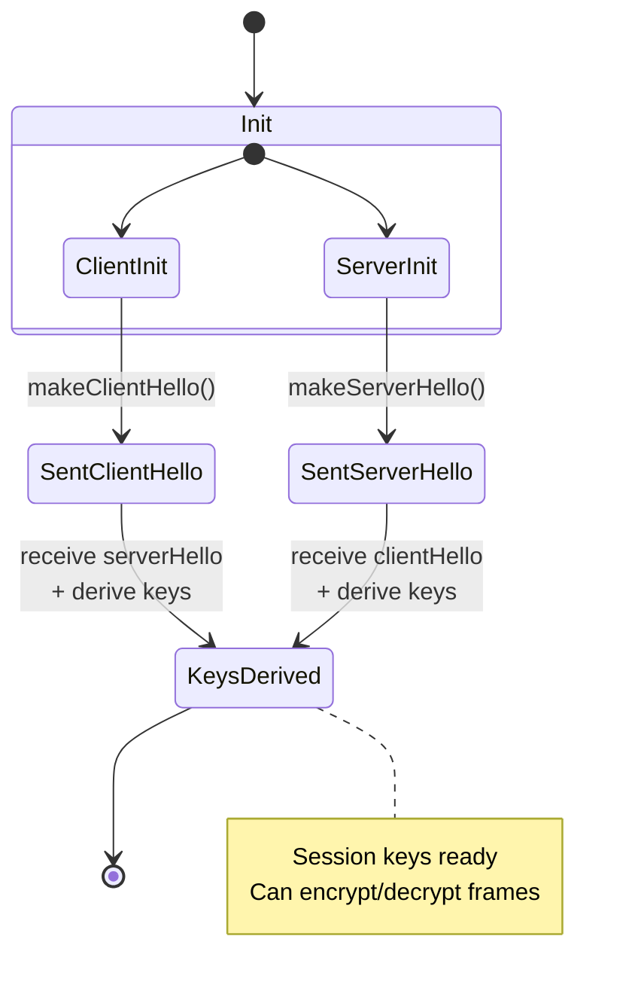

# BlazeBinary

## Secure Handshake Protocol

_Last updated: February 2025_

This document describes the secure handshake protocol for establishing encrypted BlazeBinary sessions using X25519 Diffie-Hellman key agreement.

## Overview

The handshake protocol establishes a shared secret between two parties (client and server) using X25519 key agreement, then derives session keys via HKDF-SHA256. The handshake is:

- **Asymmetric**: Client initiates, server responds
- **One round-trip**: ClientHello → ServerHello
- **Stateless**: Each party can derive keys independently after receiving the other's public key
- **Ephemeral**: New keypairs generated for each handshake

## Roles

### Client

- **Role**: Initiates the handshake
- **Action**: Generates keypair, sends `clientHello` with public key
- **Completion**: Receives `serverHello`, derives session keys

### Server

- **Role**: Responds to handshake
- **Action**: Generates keypair, sends `serverHello` with public key
- **Completion**: Receives `clientHello`, derives session keys

## Handshake Message Format

All handshake messages follow this structure:

```
<1 byte: handshakeVersion>
<1 byte: handshakeType>
<2 bytes: flags (reserved)>
<32 bytes: public key (X25519)>
```

### Message Fields

| Offset | Size | Name | Description |
|--------|------|------|-------------|
| 0 | 1 byte | `handshakeVersion` | Protocol version (currently `0x01`) |
| 1 | 1 byte | `handshakeType` | `0x01` = clientHello, `0x02` = serverHello |
| 2-3 | 2 bytes | `flags` | Reserved for future use (currently `0x0000`) |
| 4-35 | 32 bytes | `publicKey` | X25519 public key (raw 32 bytes) |

**Total message size**: 36 bytes

### Handshake Types

| Value | Name | Direction | Description |
|-------|------|-----------|-------------|
| `0x01` | `clientHello` | Client → Server | Client's public key |
| `0x02` | `serverHello` | Server → Client | Server's public key |

## Handshake Flow

### Client-Initiated Handshake



### State Machine



## Key Agreement Process

1. **Client generates keypair**:
   ```swift
   var clientHandshake = BlazeSecureHandshake(role: .client)
   let clientPublicKey = clientHandshake.localPublicKeyData()
   ```

2. **Client sends clientHello**:
   ```swift
   let clientHello = clientHandshake.makeClientHello()
   // Send over network
   ```

3. **Server receives clientHello, generates keypair**:
   ```swift
   var serverHandshake = BlazeSecureHandshake(role: .server)
   let serverPublicKey = serverHandshake.localPublicKeyData()
   ```

4. **Server sends serverHello**:
   ```swift
   let serverHello = serverHandshake.makeServerHello()
   // Send over network
   ```

5. **Both parties derive session keys**:
   ```swift
   // Client side
   let clientKeys = try clientHandshake.processInboundMessage(serverHello)
   
   // Server side
   let serverKeys = try serverHandshake.processInboundMessage(clientHello)
   ```

6. **Both parties have identical session keys**:
   - `encryptionKey`: 32 bytes (for ChaCha20-Poly1305)
   - `authenticationKey`: 32 bytes (reserved for future use)
   - `noncePrefix`: 4 bytes (random, per session)

## Handshake Frame Format

Handshake messages are wrapped in BlazeBinary frames with a special frame type:

```
<4-byte length prefix (big-endian)>
<1-byte frameType = 0x02>
<36-byte handshake message>
```

### Frame Structure

| Offset | Size | Name | Description |
|--------|------|------|-------------|
| 0-3 | 4 bytes | `length` | Payload length = 37 (1 + 36) |
| 4 | 1 byte | `frameType` | `0x02` = handshake frame |
| 5-40 | 36 bytes | `handshakeMessage` | Handshake message (version, type, flags, key) |

## Validation

### Version Check

- **Supported version**: `0x01` only
- **Invalid version**: Reject with `BlazeBinaryError.invalidHandshake`

### Type Check

- **Valid types**: `0x01` (clientHello), `0x02` (serverHello)
- **Invalid type**: Reject with `BlazeBinaryError.invalidHandshake`

### Public Key Validation

- **Length**: Must be exactly 32 bytes
- **Format**: Must be valid X25519 public key
- **Invalid key**: Reject with `BlazeBinaryError.invalidHandshake`

## Error Handling

### Invalid Handshake Message

- **Too short**: Message < 36 bytes → `BlazeBinaryError.invalidHandshake("Handshake message too short")`
- **Invalid version**: Version != 0x01 → `BlazeBinaryError.invalidHandshake("Unsupported handshake version")`
- **Invalid type**: Type not 0x01 or 0x02 → `BlazeBinaryError.invalidHandshake("Invalid handshake type")`
- **Invalid key length**: Key != 32 bytes → `BlazeBinaryError.invalidHandshake("Invalid public key length")`
- **Invalid key format**: Key not valid X25519 → `BlazeBinaryError.invalidHandshake("Invalid public key format")`

### Key Agreement Failure

- **Remote key not set**: Call `deriveSessionKeys()` before receiving remote key → `BlazeBinaryError.handshakeFailed("Remote public key not received")`
- **Key agreement error**: X25519 computation fails → `BlazeBinaryError.handshakeFailed("Key agreement failed")`

## Security Considerations

### Ephemeral Keys

- **New keypair per handshake**: Each handshake generates fresh keypairs
- **Perfect forward secrecy**: Old session keys cannot decrypt past sessions
- **No key reuse**: Private keys are never reused across sessions

### Man-in-the-Middle (MITM)

**Current Implementation**: The handshake does **not** include authentication of public keys. This means:

- **No MITM protection**: An attacker could intercept and replace public keys
- **Recommendation**: Use out-of-band key verification (e.g., certificate pinning, trusted key exchange)

**Future Enhancement**: Add optional public key authentication (e.g., Ed25519 signatures).

### Replay Protection

- **Handshake messages**: Not protected against replay
- **Recommendation**: Include nonces or timestamps in handshake messages for replay detection

## Usage Example

### Complete Handshake Flow

```swift
import BlazeBinary

// === CLIENT SIDE ===

// 1. Create handshake
var clientHandshake = BlazeSecureHandshake(role: .client)

// 2. Create and send clientHello
let clientHello = clientHandshake.makeOutboundMessage()
let clientHelloFrame = try BlazeFrameEncoder.encodeHandshakeFrame(clientHello)
// Send clientHelloFrame over network...

// 3. Receive serverHello frame
// Parse frame to get handshake payload
let parser = BlazeFrameParser()
try parser.append(serverHelloFrame)
let serverHelloPayload = try parser.nextFrame()

// 4. Process serverHello and derive keys
let clientKeys = try clientHandshake.processInboundMessage(serverHelloPayload)

// 5. Create secure session
var clientSession = BlazeSecureSession(keyMaterial: clientKeys)

// === SERVER SIDE ===

// 1. Receive clientHello frame
try parser.append(clientHelloFrame)
let clientHelloPayload = try parser.nextFrame()

// 2. Create handshake and process clientHello
var serverHandshake = BlazeSecureHandshake(role: .server)
let serverKeys = try serverHandshake.processInboundMessage(clientHelloPayload)

// 3. Create and send serverHello
let serverHello = serverHandshake.makeOutboundMessage()
let serverHelloFrame = try BlazeFrameEncoder.encodeHandshakeFrame(serverHello)
// Send serverHelloFrame over network...

// 4. Create secure session
var serverSession = BlazeSecureSession(keyMaterial: serverKeys)

// === BOTH SIDES NOW HAVE IDENTICAL SESSION KEYS ===
```

## Related Documents

- [ENCRYPTION.md](ENCRYPTION.md) - Encryption and key derivation details
- [FRAME_PROTOCOL.md](FRAME_PROTOCOL.md) - Frame format and protocol
- [THREAT_MODEL.md](THREAT_MODEL.md) - Security threat model
- [ARCHITECTURE.md](../Core/ARCHITECTURE.md) - System architecture
