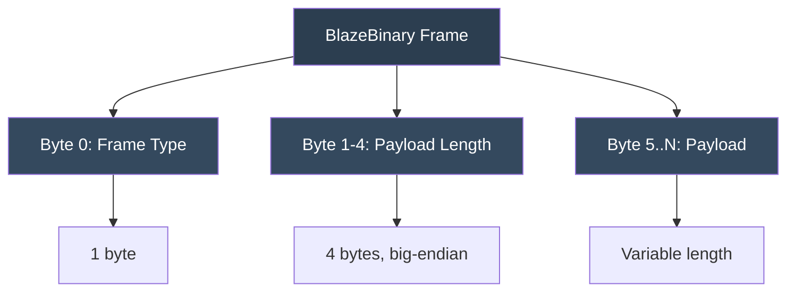
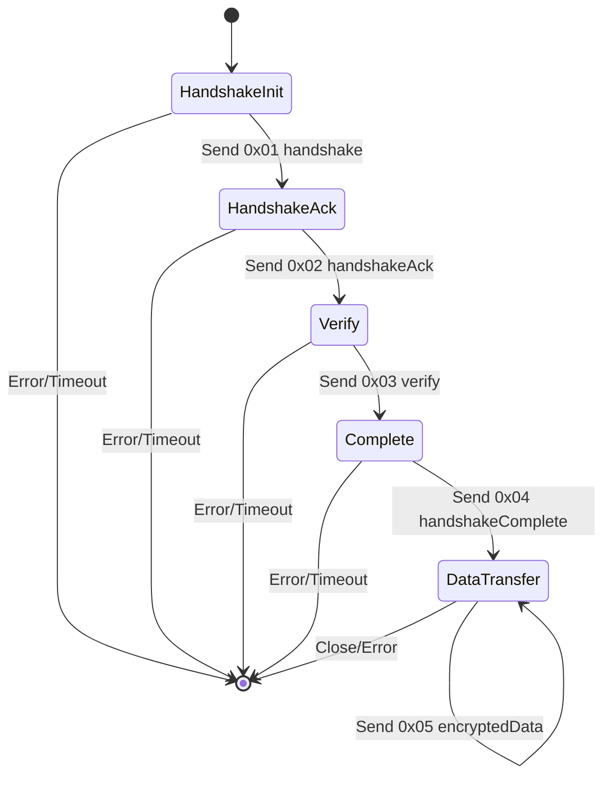

# BlazeBinary

## Frame Protocol

_Last updated: February 2025_

This document describes the frame-based transport protocol for BlazeBinary, including frame formats, frame types, and handshake state machine.

## Frame Header Schema

All frames follow this structure:



**Frame Structure**:
- Byte 0: Frame Type (1 byte)
- Byte 1-4: Payload Length (4 bytes, big-endian)
- Byte 5..N: Payload (BlazeBinary-encoded data)
- Total Size: 5 + payload.length bytes

### Frame Header Format

| Offset | Size | Name | Description |
|--------|------|------|-------------|
| 0 | 1 byte | `frameType` | Frame type identifier (see Frame Types) |
| 1-4 | 4 bytes | `payloadLength` | Payload length in bytes (big-endian UInt32) |
| 5+ | variable | `payload` | BlazeBinary-encoded payload data |

### Constraints

- **Max Frame Size**: 5 MB (5,242,880 bytes) total
- **Max Payload Size**: 5,242,875 bytes (5 MB - 5 bytes header)
- **Min Frame Size**: 5 bytes (header only, empty payload)
- **Length Validation**: `0 <= payloadLength <= 5,242,875`

## Frame Types

| Type | Value | Name | Description |
|------|-------|------|-------------|
| `0x01` | 1 | `handshake` | Initial handshake request |
| `0x02` | 2 | `handshakeAck` | Handshake acknowledgment |
| `0x03` | 3 | `verify` | Verification message |
| `0x04` | 4 | `handshakeComplete` | Handshake completion |
| `0x05` | 5 | `encryptedData` | Encrypted data payload |
| `0x06` | 6 | `operation` | Standard operation/data frame |

### Frame Type Details

#### 0x01: Handshake

**Purpose**: Initiate connection handshake

**Payload**: Handshake request data (nonce, version, capabilities)

**Example**:
```swift
struct HandshakeRequest: BlazeBinaryCodable {
    var version: UInt32
    var nonce: Data  // 16 bytes random nonce
    var capabilities: [String]
}
```

#### 0x02: HandshakeAck

**Purpose**: Acknowledge handshake request

**Payload**: Handshake acknowledgment data (nonce echo, selected capabilities)

**Example**:
```swift
struct HandshakeAck: BlazeBinaryCodable {
    var nonce: Data  // Echo of received nonce
    var selectedCapabilities: [String]
}
```

#### 0x03: Verify

**Purpose**: Verify connection integrity

**Payload**: Verification data (challenge, response)

**Example**:
```swift
struct VerifyMessage: BlazeBinaryCodable {
    var challenge: Data  // 32 bytes challenge
    var response: Data   // 32 bytes response (HMAC)
}
```

#### 0x04: HandshakeComplete

**Purpose**: Signal handshake completion

**Payload**: Completion confirmation (optional metadata)

**Example**:
```swift
struct HandshakeComplete: BlazeBinaryCodable {
    var sessionId: String
    var timestamp: UInt64
}
```

#### 0x05: EncryptedData

**Purpose**: Encrypted data payload (AES-GCM)

**Payload**: Encrypted BlazeBinary data

**Note**: Encryption is handled at application layer, not in BlazeBinary codec

#### 0x06: Operation

**Purpose**: Standard operation/data frame

**Payload**: Any BlazeBinary-encoded data (requests, responses, messages)

**Example**:
```swift
// Any BlazeBinaryCodable type
let message = Message(id: "abc", count: 42)
let encoder = BlazeBinaryEncoder()
try encoder.encode(message)
let payload = encoder.encodedData()
// Wrap in frame type 0x06
```

## Handshake State Machine

The handshake protocol follows this state machine:



### State Descriptions

#### HandshakeInit

**Client Action**: Send `0x01 handshake` frame with:
- Version number
- Random nonce (16 bytes)
- Supported capabilities

**Server Action**: Wait for handshake, validate version

**Transition**: On valid handshake → `HandshakeAck`

#### HandshakeAck

**Server Action**: Send `0x02 handshakeAck` frame with:
- Echo of client nonce
- Selected capabilities

**Client Action**: Validate nonce echo, verify capabilities

**Transition**: On valid ack → `Verify`

#### Verify

**Client Action**: Send `0x03 verify` frame with:
- Challenge (32 bytes random)
- Response (HMAC of challenge)

**Server Action**: Validate response, send own verify frame

**Transition**: On valid verification → `Complete`

#### Complete

**Server Action**: Send `0x04 handshakeComplete` frame with:
- Session ID
- Timestamp

**Client Action**: Validate session, store session ID

**Transition**: On completion → `DataTransfer`

#### DataTransfer

**Both Actions**: Send `0x06 operation` or `0x05 encryptedData` frames

**State**: Active data transfer phase

**Transition**: On close/error → `[*]`

## Frame Encoding Example

```swift
import BlazeBinary

// 1. Encode payload
let message = Message(id: "abc123", count: 42)
let encoder = BlazeBinaryEncoder()
try encoder.encode(message)
let payload = encoder.encodedData()

// 2. Create frame header
let frameType: UInt8 = 0x06  // operation
let payloadLength = UInt32(payload.count).bigEndian

// 3. Assemble frame
var frame = Data()
frame.append(frameType)
frame.append(contentsOf: withUnsafeBytes(of: payloadLength) { Array($0) })
frame.append(payload)

// 4. Send frame over network
socket.write(frame)
```

## Frame Decoding Example

```swift
import BlazeBinary

// 1. Receive frame header (5 bytes minimum)
let header = try socket.read(exactly: 5)
let frameType = header[0]
let payloadLength = UInt32(bigEndian: header.withUnsafeBytes { $0.load(fromByteOffset: 1, as: UInt32.self) })

// 2. Receive payload
let payload = try socket.read(exactly: Int(payloadLength))

// 3. Decode based on frame type
switch frameType {
case 0x01: // handshake
    let decoder = BlazeBinaryDecoder(data: payload)
    let handshake = try decoder.decode(HandshakeRequest.self)
    // Process handshake
    
case 0x06: // operation
    let decoder = BlazeBinaryDecoder(data: payload)
    let message = try decoder.decode(Message.self)
    // Process message
    
default:
    throw BlazeBinaryError.decodeFailed("Unknown frame type: \(frameType)")
}
```

## Incremental Frame Parsing

For streaming protocols, use `BlazeFrameParser`:

```swift
let parser = BlazeFrameParser()

// Append data as it arrives
try parser.append(receivedData1)
try parser.append(receivedData2)

// Extract complete frames
while let payload = try parser.nextFrame() {
    // Process complete frame payload
    let decoder = BlazeBinaryDecoder(data: payload)
    // Decode based on frame type...
}
```

## Error Handling

### Invalid Frame Length

- **Error**: `BlazeBinaryError.invalidFrameLength`
- **Cause**: Length = 0 or length > 5,242,875
- **Action**: Reject frame, close connection

### Truncated Frame

- **Error**: `BlazeBinaryError.truncated`
- **Cause**: Insufficient data for complete frame
- **Action**: Wait for more data, buffer partial frame

### Unknown Frame Type

- **Error**: `BlazeBinaryError.decodeFailed("Unknown frame type")`
- **Cause**: Frame type not in supported set
- **Action**: Reject frame, log warning

## Security Considerations

1. **Nonce Reuse**: Handshake nonces must be cryptographically random
2. **Replay Protection**: Use sequence numbers or timestamps
3. **Rate Limiting**: Limit handshake attempts to prevent DoS
4. **Timeout**: Implement handshake timeouts (e.g., 30 seconds)
5. **Encryption**: Use `0x05 encryptedData` for sensitive data

---

### Related Documents

- [Specification](SPECIFICATION.md)
- [Encoding Model](ENCODING_MODEL.md)
- [Architecture](ARCHITECTURE.md)
- [Threat Model](THREAT_MODEL.md)
- [ARCHITECTURE.md](ARCHITECTURE.md) - System architecture
- [THREAT_MODEL.md](THREAT_MODEL.md) - Security threat model

