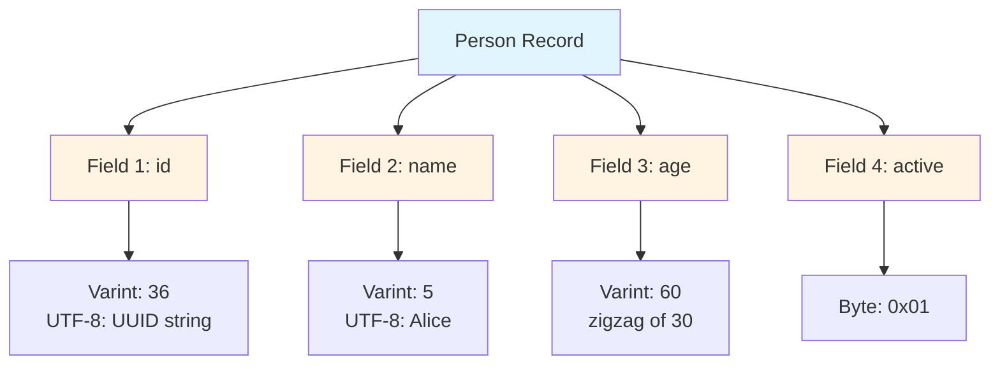
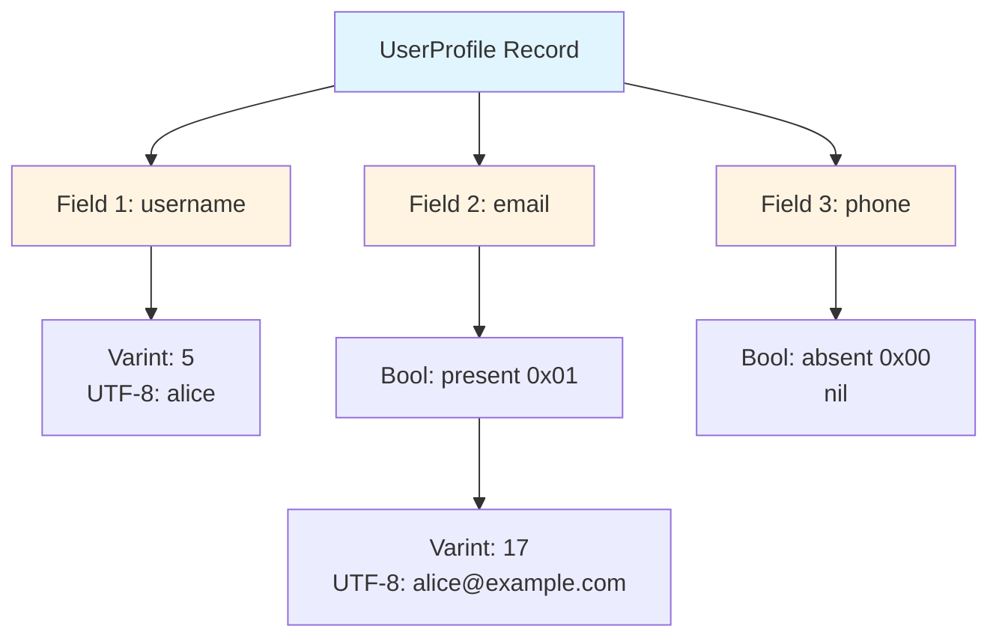

# BlazeBinary Protocol Examples

**Purpose**: This document provides real-world examples of encoding simple and nested objects using BlazeBinary.

For related documentation, see:
- [SPECIFICATION.md](SPECIFICATION.md) - Complete encoding format specification
- [FrameProtocol.md](FrameProtocol.md) - Frame format and parsing
- [README.md](../README.md) - Quick start and overview

This document shows practical usage patterns and common scenarios.

## Table of Contents

1. [Simple Types](#simple-types)
2. [Composite Types](#composite-types)
3. [Nested Structures](#nested-structures)
4. [Arrays and Collections](#arrays-and-collections)
5. [Optional Fields](#optional-fields)
6. [Schema Evolution](#schema-evolution)

---

## Simple Types

### Encoding Primitives

```swift
import BlazeBinary

let encoder = BlazeBinaryEncoder()

// Encode various primitives
encoder.encode(UInt32(42))
encoder.encode(UInt64(123456789))
encoder.encode(Int(-100))
encoder.encode(true)
encoder.encode("Hello, World!")
encoder.encode(Data([0x01, 0x02, 0x03]))

let data = encoder.encodedData()
```

### Decoding Primitives

```swift
let decoder = BlazeBinaryDecoder(data: data)

// Decode in the same order
let uint32 = try decoder.decodeUInt32()      // 42
let uint64 = try decoder.decodeUInt64()      // 123456789
let int = try decoder.decodeInt()            // -100
let bool = try decoder.decodeBool()          // true
let string = try decoder.decodeString()      // "Hello, World!"
let data = try decoder.decodeData()          // Data([0x01, 0x02, 0x03])
```

---

## Composite Types

### Basic Struct

```swift
struct Person: BlazeBinaryCodable {
    var id: UUID
    var name: String
    var age: Int
    var active: Bool
    
    func blazeEncode(to encoder: BlazeBinaryEncoder) throws {
        // Order matters! Must match init(from:)
        encoder.encode(id.uuidString)
        encoder.encode(name)
        encoder.encode(age)
        encoder.encode(active)
    }
    
    init(from decoder: BlazeBinaryDecoder) throws {
        // Decode in the exact same order
        let idString = try decoder.decodeString()
        guard let uuid = UUID(uuidString: idString) else {
            throw BlazeBinaryError.decodeFailed("Invalid UUID")
        }
        self.id = uuid
        self.name = try decoder.decodeString()
        self.age = try decoder.decodeInt()
        self.active = try decoder.decodeBool()
    }
}

// Usage
let person = Person(
    id: UUID(),
    name: "Alice",
    age: 30,
    active: true
)

let encoder = BlazeBinaryEncoder()
try encoder.encode(person)
let data = encoder.encodedData()

let decoder = BlazeBinaryDecoder(data: data)
let decoded = try decoder.decode(Person.self)
```

### Binary Layout

For `Person(id: UUID("550e8400-..."), name: "Alice", age: 30, active: true)`:



---

## Nested Structures

### Simple Nesting

```swift
struct Address: BlazeBinaryCodable {
    var street: String
    var city: String
    var zipCode: String
    
    func blazeEncode(to encoder: BlazeBinaryEncoder) throws {
        encoder.encode(street)
        encoder.encode(city)
        encoder.encode(zipCode)
    }
    
    init(from decoder: BlazeBinaryDecoder) throws {
        self.street = try decoder.decodeString()
        self.city = try decoder.decodeString()
        self.zipCode = try decoder.decodeString()
    }
}

struct Employee: BlazeBinaryCodable {
    var name: String
    var address: Address
    var salary: Int
    
    func blazeEncode(to encoder: BlazeBinaryEncoder) throws {
        encoder.encode(name)
        try encoder.encode(address)  // Nested struct
        encoder.encode(salary)
    }
    
    init(from decoder: BlazeBinaryDecoder) throws {
        self.name = try decoder.decodeString()
        self.address = try decoder.decode(Address.self)
        self.salary = try decoder.decodeInt()
    }
}
```

### Deep Nesting

```swift
struct Company: BlazeBinaryCodable {
    var name: String
    var employees: [Employee]
    var headquarters: Address
    
    func blazeEncode(to encoder: BlazeBinaryEncoder) throws {
        encoder.encode(name)
        try encoder.encode(employees)  // Array of nested structs
        try encoder.encode(headquarters)
    }
    
    init(from decoder: BlazeBinaryDecoder) throws {
        self.name = try decoder.decodeString()
        self.employees = try decoder.decodeArray(Employee.self)
        self.headquarters = try decoder.decode(Address.self)
    }
}
```

---

## Arrays and Collections

### Array of Primitives

```swift
struct Scores: BlazeBinaryCodable {
    var values: [Int]
    
    func blazeEncode(to encoder: BlazeBinaryEncoder) throws {
        // Encode count
        encoder.encode(values.count)
        // Encode each value
        for value in values {
            encoder.encode(value)
        }
    }
    
    init(from decoder: BlazeBinaryDecoder) throws {
        let count = try decoder.decodeInt()
        var decoded: [Int] = []
        decoded.reserveCapacity(count)
        for _ in 0..<count {
            decoded.append(try decoder.decodeInt())
        }
        self.values = decoded
    }
}
```

### Array of Custom Types

```swift
struct WorkStep: BlazeBinaryCodable {
    var description: String
    var completed: Bool
    
    func blazeEncode(to encoder: BlazeBinaryEncoder) throws {
        encoder.encode(description)
        encoder.encode(completed)
    }
    
    init(from decoder: BlazeBinaryDecoder) throws {
        self.description = try decoder.decodeString()
        self.completed = try decoder.decodeBool()
    }
}

struct WorkPlan: BlazeBinaryCodable {
    var title: String
    var steps: [WorkStep]
    
    func blazeEncode(to encoder: BlazeBinaryEncoder) throws {
        encoder.encode(title)
        try encoder.encode(steps)  // Uses encode(_ array:)
    }
    
    init(from decoder: BlazeBinaryDecoder) throws {
        self.title = try decoder.decodeString()
        self.steps = try decoder.decodeArray(WorkStep.self)
    }
}
```

### Using Convenience APIs

```swift
struct TaskList: BlazeBinaryCodable {
    var tasks: [WorkStep]
    
    func blazeEncode(to encoder: BlazeBinaryEncoder) throws {
        // Use convenience API
        try encoder.encodeCollection(tasks)
    }
    
    init(from decoder: BlazeBinaryDecoder) throws {
        // Use convenience API
        self.tasks = try decoder.decodeCollection() as [WorkStep]
    }
}
```

---

## Optional Fields

### Encoding Optionals

```swift
struct UserProfile: BlazeBinaryCodable {
    var username: String
    var email: String?
    var phone: String?
    
    func blazeEncode(to encoder: BlazeBinaryEncoder) throws {
        encoder.encode(username)
        try encoder.encode(email)      // Optional encoding
        try encoder.encode(phone)       // Optional encoding
    }
    
    init(from decoder: BlazeBinaryDecoder) throws {
        self.username = try decoder.decodeString()
        self.email = try decoder.decodeOptional(String.self)
        self.phone = try decoder.decodeOptional(String.self)
    }
}
```

### Binary Layout for Optionals

For `UserProfile(username: "alice", email: "alice@example.com", phone: nil)`:



---

## Schema Evolution

### Adding Fields (Forward Compatibility)

```swift
// Version 1: Original struct
struct MessageV1: BlazeBinaryCodable {
    var text: String
    
    func blazeEncode(to encoder: BlazeBinaryEncoder) throws {
        encoder.encode(text)
    }
    
    init(from decoder: BlazeBinaryDecoder) throws {
        self.text = try decoder.decodeString()
    }
}

// Version 2: Added optional field
struct MessageV2: BlazeBinaryCodable {
    var text: String
    var timestamp: Int?  // New field
    
    func blazeEncode(to encoder: BlazeBinaryEncoder) throws {
        encoder.encode(text)
        try encoder.encode(timestamp)
    }
    
    init(from decoder: BlazeBinaryDecoder) throws {
        self.text = try decoder.decodeString()
        // Try to decode new field, use nil if not present
        self.timestamp = try? decoder.decodeOptional(Int.self)
    }
}
```

### Removing Fields (Backward Compatibility)

```swift
// Version 1: Has both fields
struct ConfigV1: BlazeBinaryCodable {
    var host: String
    var port: Int
    
    func blazeEncode(to encoder: BlazeBinaryEncoder) throws {
        encoder.encode(host)
        encoder.encode(port)
    }
    
    init(from decoder: BlazeBinaryDecoder) throws {
        self.host = try decoder.decodeString()
        self.port = try decoder.decodeInt()
    }
}

// Version 2: Removed port field
struct ConfigV2: BlazeBinaryCodable {
    var host: String
    // port removed
    
    func blazeEncode(to encoder: BlazeBinaryEncoder) throws {
        encoder.encode(host)
    }
    
    init(from decoder: BlazeBinaryDecoder) throws {
        self.host = try decoder.decodeString()
        // Skip port field if present (for backward compatibility)
        if decoder.offset < decoder.data.count {
            try? decoder.skipUnknownField()
        }
    }
}
```

### Using decodeIfPresent

```swift
struct FlexibleMessage: BlazeBinaryCodable {
    var text: String
    var metadata: String?
    
    func blazeEncode(to encoder: BlazeBinaryEncoder) throws {
        encoder.encode(text)
        if let metadata = metadata {
            encoder.encode(metadata)
        }
    }
    
    init(from decoder: BlazeBinaryDecoder) throws {
        self.text = try decoder.decodeString()
        // Try to decode if present, nil if data exhausted
        self.metadata = try decoder.decodeIfPresent(String.self)
    }
}
```

---

## Complete Example: Network Protocol

```swift
// Request message
struct Request: BlazeBinaryCodable {
    var id: UUID
    var method: String
    var parameters: [String]
    
    func blazeEncode(to encoder: BlazeBinaryEncoder) throws {
        encoder.encode(id.uuidString)
        encoder.encode(method)
        try encoder.encode(parameters.map { StringItem(value: $0) })
    }
    
    init(from decoder: BlazeBinaryDecoder) throws {
        let idString = try decoder.decodeString()
        guard let uuid = UUID(uuidString: idString) else {
            throw BlazeBinaryError.decodeFailed("Invalid UUID")
        }
        self.id = uuid
        self.method = try decoder.decodeString()
        let items = try decoder.decodeArray(StringItem.self)
        self.parameters = items.map { $0.value }
    }
}

struct StringItem: BlazeBinaryCodable {
    var value: String
    
    func blazeEncode(to encoder: BlazeBinaryEncoder) throws {
        encoder.encode(value)
    }
    
    init(from decoder: BlazeBinaryDecoder) throws {
        self.value = try decoder.decodeString()
    }
}

// Encode and frame for network
let request = Request(
    id: UUID(),
    method: "GET",
    parameters: ["key1", "value1"]
)

let encoder = BlazeBinaryEncoder()
try encoder.encode(request)
let payload = encoder.encodedData()

// Wrap in frame
let frame = try BlazeFrameEncoder.encodeFrame(payload)
// Send frame over network...

// Receive and decode
let parser = BlazeFrameParser()
try parser.append(receivedData)

if let payload = try parser.nextFrame() {
    let decoder = BlazeBinaryDecoder(data: payload)
    let decoded = try decoder.decode(Request.self)
    // Process request...
}
```

---

## Best Practices

1. **Always match encoding/decoding order**: Fields must be encoded and decoded in the same order
2. **Use optionals for new fields**: Makes schema evolution easier
3. **Validate critical data**: Check UUIDs, ranges, etc. during decoding
4. **Use convenience APIs**: `encodeCollection` and `decodeCollection` for cleaner code
5. **Handle errors gracefully**: Use `try?` or `decodeIfPresent` for optional fields
6. **Test round-trips**: Always verify encoding → decoding produces the same value

