# BlazeBinary Security Documentation

_Last updated: December 2025_

This document provides comprehensive security documentation for BlazeBinary, including cryptographic protocols, security guarantees, attack surfaces, and best practices.

## Table of Contents

1. [Security Overview](#security-overview)
2. [Cryptographic Protocols](#cryptographic-protocols)
3. [Handshake Protocol](#handshake-protocol)
4. [Encryption Protocol](#encryption-protocol)
5. [Security Guarantees](#security-guarantees)
6. [Attack Surfaces](#attack-surfaces)
7. [Threat Mitigations](#threat-mitigations)
8. [Best Practices](#best-practices)

## Security Overview

BlazeBinary provides **optional** secure session mode with:

- **X25519 Diffie-Hellman** key agreement for establishing shared secrets
- **HKDF-SHA256** key derivation for session key generation
- **ChaCha20-Poly1305** AEAD encryption for frame payloads
- **Explicit compression mode** (v2.0) eliminating autodetection false positives

### Security Model

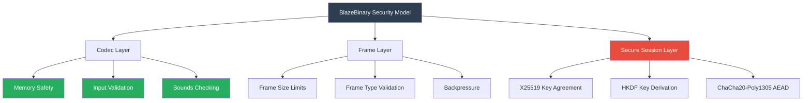

## Cryptographic Protocols

### X25519 Diffie-Hellman Key Agreement

BlazeBinary uses X25519 (Curve25519) for key agreement:

- **Security Level**: 128 bits
- **Key Size**: 32 bytes (public and private)
- **Standard**: RFC 7748
- **Properties**: Fast, secure, widely deployed

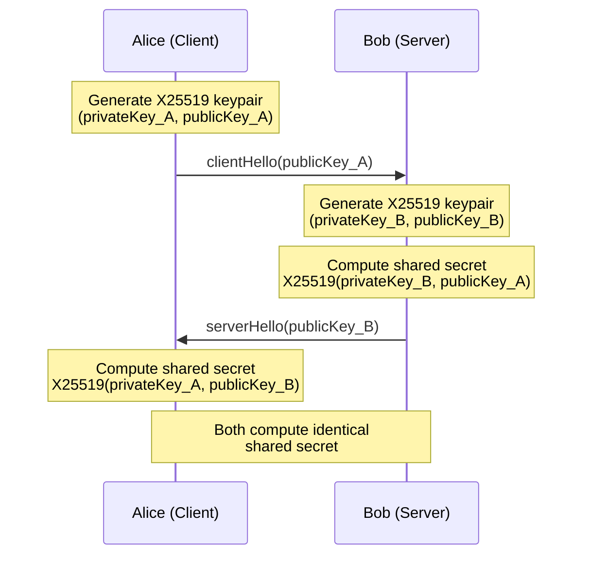

### HKDF-SHA256 Key Derivation

Session keys are derived using HKDF-SHA256:

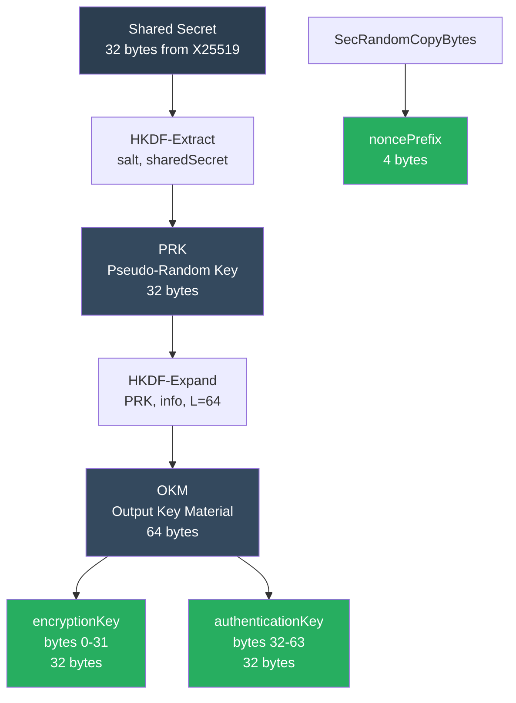

**Key Derivation Process**:

1. **Extract Phase**:
   ```
   PRK = HMAC-SHA256(salt, sharedSecret)
   ```
   - Default: `salt = nil` (zero-length salt)

2. **Expand Phase**:
   ```
   OKM = HKDF-Expand(PRK, info, L = 64)
   ```
   - Default: `info = "BlazeBinarySession"` (UTF-8)
   - Output: 64 bytes

3. **Key Splitting**:
   ```
   encryptionKey = OKM[0..<32]
   authenticationKey = OKM[32..<64]
   ```

4. **Nonce Prefix**:
   ```
   noncePrefix = Random(4 bytes)  // SecRandomCopyBytes
   ```

### ChaCha20-Poly1305 AEAD Encryption

Frame payloads are encrypted using ChaCha20-Poly1305:

- **Algorithm**: ChaCha20 stream cipher + Poly1305 MAC
- **Key Size**: 32 bytes (256 bits)
- **Nonce Size**: 12 bytes (96 bits)
- **Tag Size**: 16 bytes (128 bits)
- **Standard**: RFC 8439

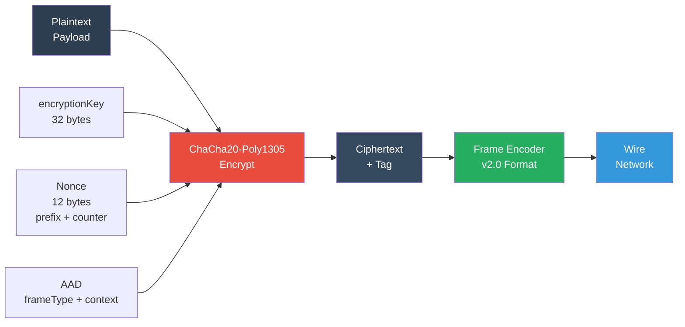

## Handshake Protocol

### Full Handshake Flow

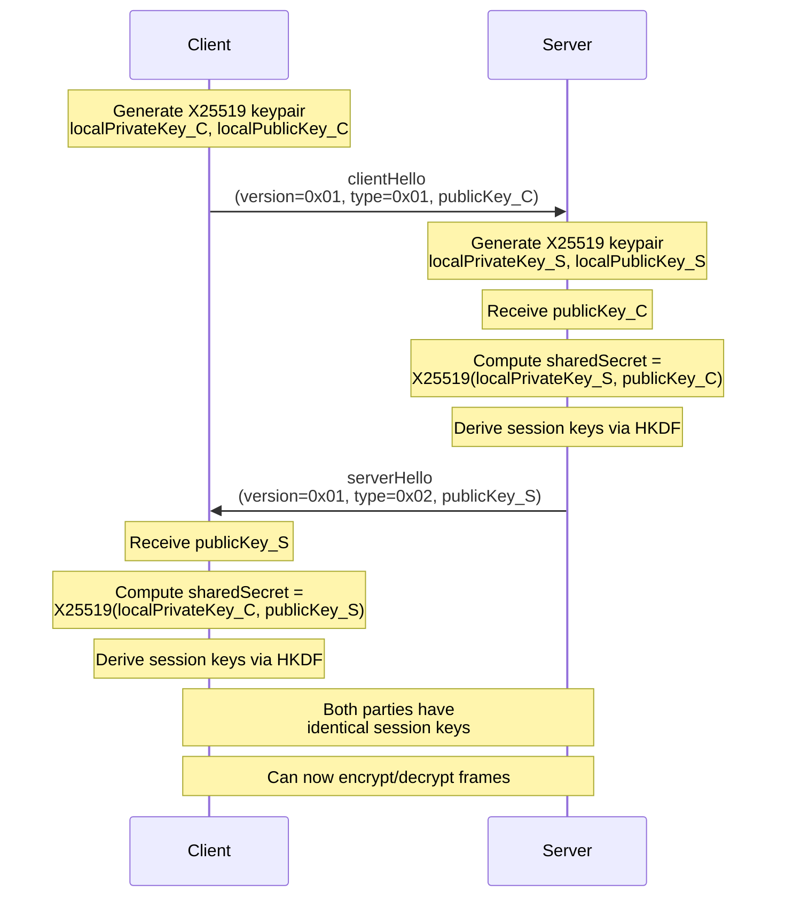

### Handshake State Machine

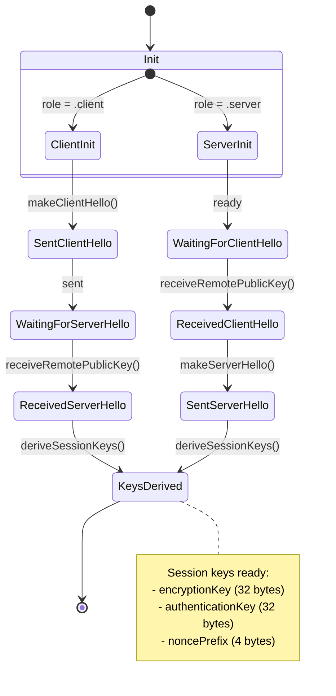

### Handshake Message Format

```
Byte 0:   handshakeVersion (0x01)
Byte 1:   handshakeType (0x01 = clientHello, 0x02 = serverHello)
Bytes 2-3: flags (0x0000, reserved)
Bytes 4-35: publicKey (32 bytes, X25519)
```

**Total**: 36 bytes

## Encryption Protocol

### Frame Format (v2.0)

BlazeBinary v2.0 uses explicit frame format:

```
Byte 0:   frameType (0x00 = plaintext, 0x01 = encrypted, 0x02 = handshake)
Byte 1:   compressionMode (0x00 = none, 0x01 = LZ4, 0x02 = LZFSE)
Bytes 2-5: payloadLength (UInt32 big-endian)
Bytes 6+: payload (compressed or raw)
```

### Encrypted Frame Layout

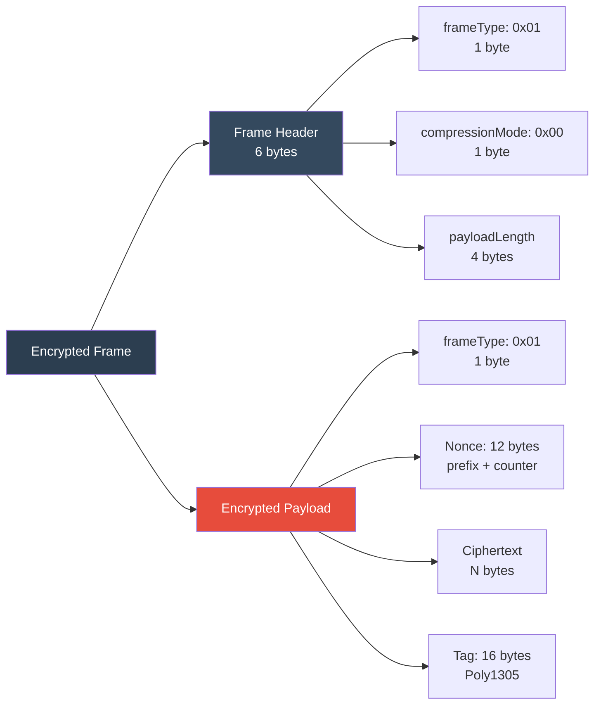

**Encrypted Payload Structure**:
- Byte 0: `frameType = 0x01` (for AAD)
- Bytes 1-12: Nonce (4-byte prefix + 8-byte counter, big-endian)
- Bytes 13..(N+12): Ciphertext
- Bytes (N+13)..(N+28): Poly1305 tag (16 bytes)

### Nonce Construction

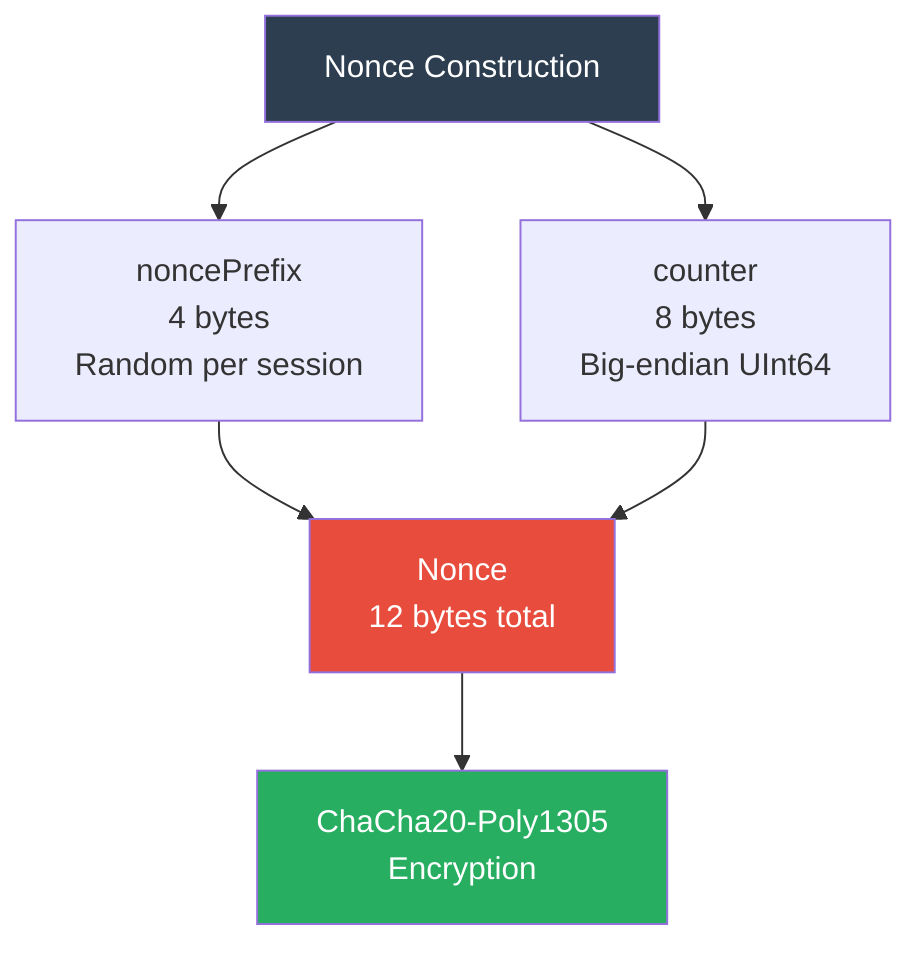

**Nonce Properties**:
- **Unique per frame**: Counter increments for each encrypted frame
- **Separate counters**: `sendCounter` for outbound, `recvCounter` for inbound
- **No reuse**: Each frame uses a unique nonce
- **Random prefix**: 4-byte prefix ensures nonce uniqueness across sessions

### AAD (Additional Authenticated Data)

AAD prevents cross-protocol attacks and ensures frame type integrity:

```
AAD = frameType (1 byte) || "BlazeBinaryFrame" (16 bytes UTF-8)
```

- `frameType = 0x01` for encrypted frames
- Static context string: "BlazeBinaryFrame"
- Included in Poly1305 tag calculation but not encrypted

## Security Guarantees

### Cryptographic Guarantees

| Guarantee | Status | Notes |
|-----------|--------|-------|
| **Confidentiality** | ✅ Yes | ChaCha20-Poly1305 provides encryption |
| **Authentication** | ✅ Yes | Poly1305 tag verifies integrity |
| **Perfect Forward Secrecy** | ✅ Yes | Ephemeral X25519 keys |
| **Replay Protection** | ⚠️ Partial | Counter tracking, no automatic rejection |
| **MITM Protection** | ❌ No | No public key authentication |
| **Key Compromise** | ✅ Yes | Old sessions remain secure (PFS) |

### Memory Safety Guarantees

- ✅ **No buffer overflows**: All reads are bounds-checked
- ✅ **No use-after-free**: Swift memory management
- ✅ **No double-free**: Swift ARC
- ✅ **Safe pointer operations**: Uses Swift safe APIs

### Input Validation Guarantees

- ✅ **Frame size limits**: 5 MB maximum
- ✅ **Length validation**: All lengths validated before use
- ✅ **Type validation**: Frame types and compression modes validated
- ✅ **Key validation**: Public keys validated (size, format)

## Attack Surfaces

### 1. Handshake Attacks

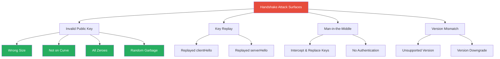

**Mitigations**:
- ✅ Public key size validation (must be 32 bytes)
- ✅ Public key format validation (X25519)
- ✅ Version check (must be 0x01)
- ⚠️ No MITM protection (requires out-of-band verification)

### 2. Encryption Attacks

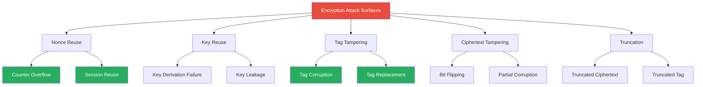

**Mitigations**:
- ✅ Unique nonces per frame (counter + random prefix)
- ✅ Separate send/recv counters
- ✅ Poly1305 tag verification (tampering detected)
- ✅ AAD includes frame type (cross-protocol protection)

### 3. Frame Protocol Attacks

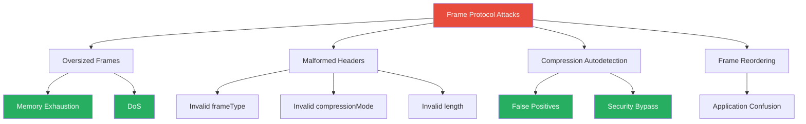

**Mitigations**:
- ✅ Frame size limit (5 MB)
- ✅ Explicit compression mode (v2.0, no autodetection)
- ✅ Frame type validation
- ✅ Header validation

## Threat Mitigations

### Error Conditions State Machine

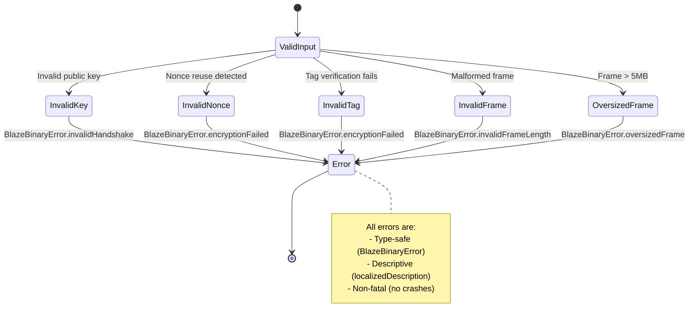

### Attack Response Matrix

| Attack | Detection | Response | Severity |
|--------|-----------|----------|----------|
| Invalid public key | ✅ Size/format check | Reject with error | Low |
| Nonce reuse | ⚠️ Counter tracking | Log warning | Medium |
| Tag tampering | ✅ Poly1305 verification | Reject with error | High |
| Ciphertext tampering | ✅ Poly1305 verification | Reject with error | High |
| Oversized frame | ✅ Size check | Reject with error | Medium |
| Malformed frame | ✅ Header validation | Reject with error | Low |
| Compression false positive | ✅ Explicit mode (v2.0) | N/A (eliminated) | None |

## Best Practices

### For Application Developers

1. **Always validate handshake keys**: Use out-of-band verification (certificates, key fingerprints)
2. **Monitor nonce counters**: Detect potential nonce reuse or replay attacks
3. **Set appropriate limits**: Configure `maxFrameSize` based on use case
4. **Use compression judiciously**: Only compress when beneficial, use explicit mode
5. **Implement replay protection**: Use application-level sequence numbers
6. **Rotate keys regularly**: Establish new sessions periodically
7. **Monitor error rates**: High error rates may indicate attacks

### For Library Maintainers

1. **Keep dependencies updated**: Swift Crypto, Compression framework
2. **Regular security audits**: Review cryptographic implementations
3. **Fuzz testing**: Test with randomized corrupted inputs
4. **Clear error messages**: Help developers understand failures
5. **Documentation**: Keep security docs up to date
6. **Version compatibility**: Maintain backwards compatibility carefully

### Security Checklist

- [ ] Handshake keys validated out-of-band
- [ ] Frame size limits configured appropriately
- [ ] Nonce counters monitored for anomalies
- [ ] Error handling implemented for all failure modes
- [ ] Compression mode explicitly set (v2.0)
- [ ] Session keys rotated periodically
- [ ] Replay protection implemented at application layer
- [ ] Security updates applied promptly

## Related Documents

- [THREAT_MODEL.md](THREAT_MODEL.md) - Detailed threat model
- [HANDSHAKE.md](HANDSHAKE.md) - Handshake protocol specification
- [ENCRYPTION.md](ENCRYPTION.md) - Encryption protocol details
- [FRAME_PROTOCOL.md](FRAME_PROTOCOL.md) - Frame format specification
- [ARCHITECTURE.md](ARCHITECTURE.md) - System architecture

---

**Security Contact**: See [SECURITY.md](../SECURITY.md) for reporting security vulnerabilities.

