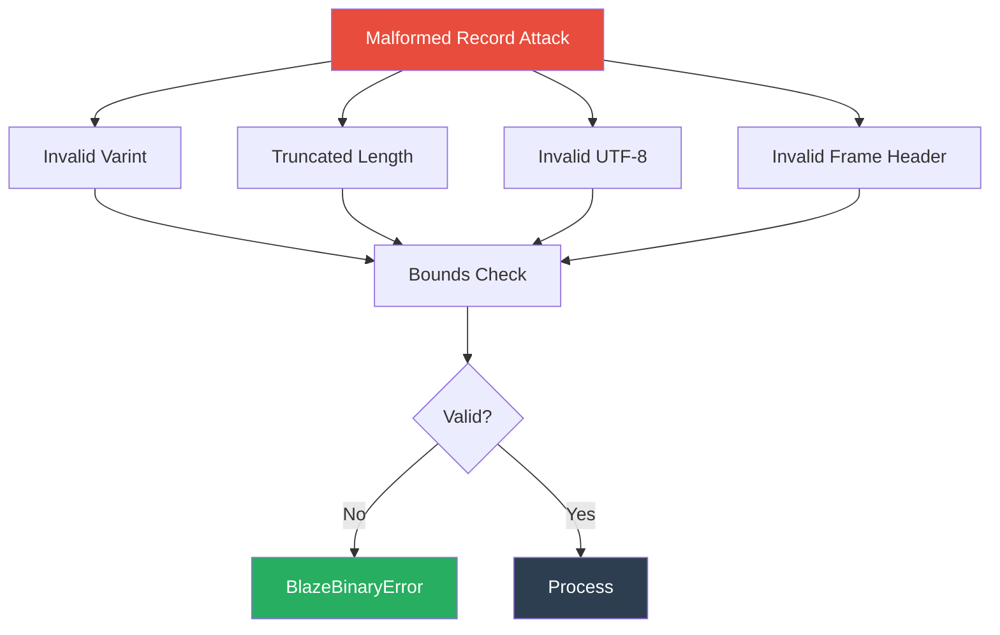
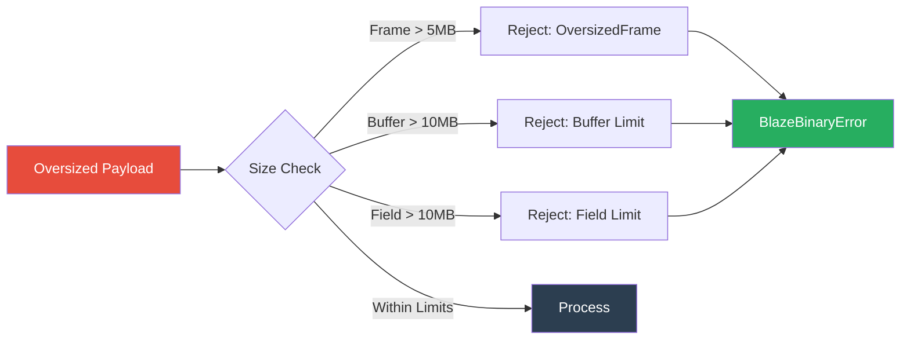
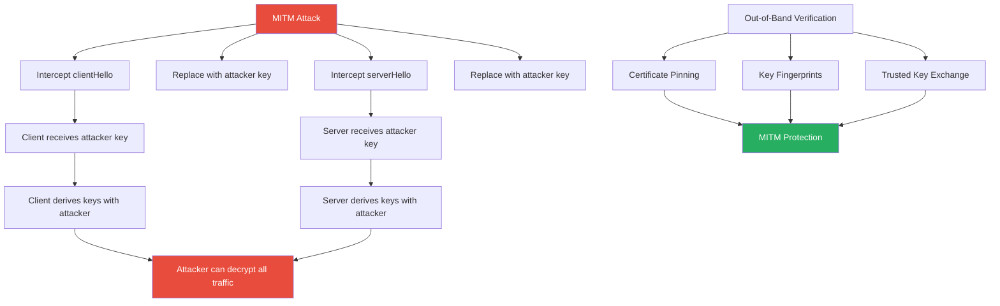
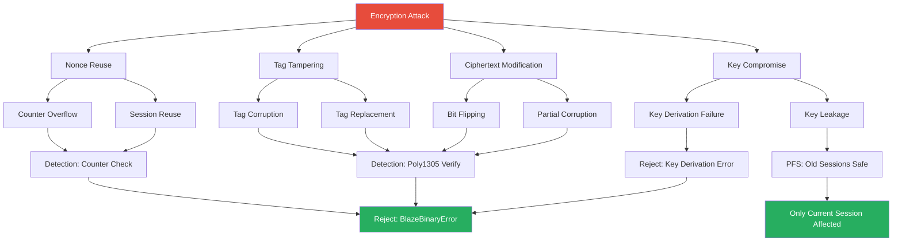

# BlazeBinary

## Threat Model

_Last updated: February 2025_

This document provides a comprehensive threat model for BlazeBinary, identifying attack surfaces, potential vulnerabilities, and mitigations.

## Scope

BlazeBinary is a **binary codec library** that provides:
- Deterministic encoding/decoding of Swift types
- Frame-based transport protocol
- Zero-copy decoding optimizations

**Out of Scope**:
- Network transport security (use TLS)
- Application-level authentication
- Key management
- Side-channel attacks

## Attack Surfaces

### 1. Malformed Records

**Attack**: Sending intentionally malformed binary data to cause crashes or undefined behavior.

**Vectors**:
- Invalid varint encodings (too many bytes, overflow)
- Truncated length prefixes
- Invalid UTF-8 sequences
- Invalid frame headers

**Mitigations**:
- Strict bounds checking before all reads
- Varint validation (max 10 bytes, shift overflow protection)
- UTF-8 validation with clear error messages
- Frame length validation (0 < length <= 5MB)

**Residual Risk**: Low - all malformed data is rejected with `BlazeBinaryError`

### 2. CRC Spoofing

**Attack**: Modifying payload data and recalculating CRC32 to bypass integrity checks.

**Current Status**: BlazeBinary does **not** include CRC32 at the codec layer.

**Mitigations**:
- Application layer should implement CRC32 or HMAC
- Use authenticated encryption (AES-GCM) for transport
- Validate message integrity at application layer

**Residual Risk**: Medium - depends on application-layer security

### 3. Oversized Buffers

**Attack**: Sending extremely large but valid payloads to exhaust memory.

**Vectors**:
- Large frame payloads (up to 5MB limit)
- Large string/data fields (up to 10MB limit)
- Large arrays (up to 10MB elements)

**Mitigations**:
- Hard limits: 5MB frame, 10MB buffer, 10MB field
- Configurable `maxAllowedLength` parameter
- Fail-fast rejection of oversized data

**Residual Risk**: Medium - valid but large payloads can still cause DoS

**Recommendation**: Set `maxAllowedLength` based on application requirements

### 4. Field Dictionary Poisoning

**Attack**: Exploiting field dictionary compression to cause confusion or attacks.

**Current Status**: BlazeBinary does **not** implement field dictionary compression.

**Mitigations**: N/A (feature not implemented)

**Residual Risk**: None (feature not present)

### 5. Reordering Attacks

**Attack**: Reordering fields or frames to cause application-level confusion.

**Mitigations**:
- Deterministic encoding: field order is explicit
- Frame sequence: application layer should track frame order
- Application-level validation: validate decoded data structure

**Residual Risk**: Low - encoding is deterministic, but application must validate

### 6. Transport Replay

**Attack**: Replaying previously captured frames to cause duplicate processing.

**Mitigations**:
- Application layer should implement sequence numbers
- Use nonces in handshake protocol
- Implement idempotency checks at application layer

**Residual Risk**: Medium - depends on application-layer protection

### 7. Frame Truncation

**Attack**: Sending partial frames to cause parsing errors or resource exhaustion.

**Vectors**:
- Truncated frame headers
- Partial payloads
- Incomplete varint encodings

**Mitigations**:
- `BlazeFrameParser` handles partial frames gracefully
- Returns `nil` when more data is needed
- Bounds checking prevents over-reads

**Residual Risk**: Low - parser handles partial frames correctly

### 8. Handshake Spoofing

**Attack**: Impersonating a peer during handshake to establish unauthorized connections.

**Current Status**: BlazeBinary **includes** X25519 handshake protocol (v1.2+).

**Vectors**:
- Man-in-the-middle (MITM) attacks
- Public key replacement
- Replayed handshake messages

**Mitigations**:
- Ephemeral keypairs (new keys per handshake)
- Perfect forward secrecy
- Out-of-band key verification recommended
- Version validation (must be 0x01)

**Residual Risk**: Medium - MITM protection requires out-of-band verification

### 9. Encryption Attacks

**Attack**: Attacking the encryption layer to decrypt or tamper with frames.

**Vectors**:
- Nonce reuse attacks
- Tag tampering
- Ciphertext modification
- Key compromise

**Mitigations**:
- Unique nonces per frame (counter + random prefix)
- Poly1305 tag verification (tampering detected)
- AAD includes frame type (cross-protocol protection)
- Perfect forward secrecy (ephemeral keys)

**Residual Risk**: Low - strong cryptographic guarantees

## Threat Matrix

| Threat | Likelihood | Impact | Mitigation | Residual Risk |
|--------|-----------|--------|------------|----------------|
| Malformed Records | High | Medium | Strict validation | Low |
| CRC Spoofing | Medium | High | Application layer | Medium |
| Oversized Buffers | High | High | Hard limits | Medium |
| Field Dictionary Poisoning | Low | Low | N/A | None |
| Reordering Attacks | Medium | Medium | Deterministic encoding | Low |
| Transport Replay | Medium | Medium | Application layer | Medium |
| Frame Truncation | High | Low | Graceful handling | Low |
| Handshake Spoofing | Medium | High | Out-of-band verification | Medium |
| Encryption Attacks | Low | High | Strong cryptography | Low |
| Nonce Reuse | Low | High | Counter + random prefix | Low |
| Tag Tampering | Medium | High | Poly1305 verification | Low |

## Security Guarantees

BlazeBinary provides the following security guarantees:

### Memory Safety
- No buffer overflows
- No use-after-free
- No double-free
- Bounds checking on all reads

### Integer Safety
- No integer overflows in varint decoding
- Shift overflow protection
- Maximum varint size enforcement

### Input Validation
- All lengths validated before use
- UTF-8 validation
- Frame size limits enforced
- Type validation

### Determinism
- Same input always produces same output
- No non-deterministic behavior
- Predictable error handling

## Security Guarantees vs Non-Goals

| Area                      | Guarantee? | Notes |
|---------------------------|-----------|-------|
| Deterministic encoding    | Yes       | Same input → same bytes, per spec. |
| Memory safety (Swift)     | Yes       | Uses Swift safe APIs; no raw pointer arithmetic exposed. |
| On-wire confidentiality   | Yes (Secure Mode) | ChaCha20-Poly1305 encryption in secure session mode. |
| On-wire integrity/auth    | Yes (Secure Mode) | Poly1305 tag provides cryptographic authentication. |
| Replay protection         | Partial | Counter tracking; application layer should implement strict replay protection. |
| Schema / type validation  | Best-effort | Decoder enforces structural rules but cannot prevent all semantic misuse. |
| Side-channel resistance   | No        | Not specifically hardened for timing/power analysis. |
| MITM protection           | No | Requires out-of-band key verification (certificates, fingerprints). |
| Perfect forward secrecy  | Yes | Ephemeral X25519 keys ensure PFS. |

## Recommendations

### For Application Developers

1. **Set appropriate limits**: Configure `maxAllowedLength` based on your use case
2. **Validate decoded data**: Don't trust decoded values without validation
3. **Use authenticated encryption**: When transmitting over untrusted networks
4. **Implement sequence numbers**: For replay protection
5. **Monitor resource usage**: Watch for memory and CPU exhaustion

### For Library Maintainers

1. **Keep tests comprehensive**: Maintain high test coverage
2. **Fuzz testing**: Use fuzzing to find edge cases
3. **Security audits**: Regular security reviews
4. **Clear error messages**: Help developers understand failures
5. **Documentation**: Keep threat model up to date

---

### Related Documents

- [Security Policy](../SECURITY.md)
- [Specification](SPECIFICATION.md)
- [Architecture](ARCHITECTURE.md)
- [Benchmarks](BENCHMARKS.md)

