# BlazeBinary

A production-grade, deterministic binary encoding/decoding library for Swift. BlazeBinary provides efficient, safe, and predictable serialization without dependencies on JSON, CBOR, or PropertyList formats.

## Quick Start

```swift
import BlazeBinary

// Define a type
struct Message: BlazeBinaryCodable {
    var id: UUID
    var text: String
    var count: Int
    
    func blazeEncode(to encoder: BlazeBinaryEncoder) throws {
        encoder.encode(id.uuidString)
        encoder.encode(text)
        encoder.encode(count)
    }
    
    init(from decoder: BlazeBinaryDecoder) throws {
        let idString = try decoder.decodeString()
        guard let uuid = UUID(uuidString: idString) else {
            throw BlazeBinaryError.decodeFailed("Invalid UUID")
        }
        self.id = uuid
        self.text = try decoder.decodeString()
        self.count = try decoder.decodeInt()
    }
}

// Encode
let message = Message(id: UUID(), text: "Hello", count: 42)
let encoder = BlazeBinaryEncoder()
try encoder.encode(message)
let binaryData = encoder.encodedData()

// Frame for transport
let frame = try BlazeFrameEncoder.encodeFrame(binaryData)

// Decode
let parser = BlazeFrameParser()
try parser.append(frame)
if let payload = try parser.nextFrame() {
    let decoder = BlazeBinaryDecoder(data: payload)
    let decoded = try decoder.decode(Message.self)
}
```

## When to Use BlazeBinary

Use BlazeBinary when you need:

- **Deterministic serialization**: Same input always produces identical bytes (critical for hashing, content addressing, testing)
- **High performance**: Zero-copy decoding, minimal allocations, efficient varint encoding
- **Type safety**: Compile-time type checking with protocol-based design
- **Security**: Strict bounds checking, size limits, fail-fast error handling
- **Streaming support**: Incremental frame parsing for network protocols
- **No external dependencies**: Pure Swift, only Foundation

Do not use BlazeBinary if you need:
- Human-readable formats (use JSON)
- Schema evolution with automatic migration (BlazeBinary requires manual handling)
- Dynamic typing or reflection-based encoding

## Documentation

- **[SPECIFICATION.md](Docs/SPECIFICATION.md)** - Complete encoding format specification (varint, ZigZag, endianness, size limits)
- **[FRAME_PROTOCOL.md](Docs/FRAME_PROTOCOL.md)** - Frame format and incremental parsing semantics
- **[ProtocolExamples.md](Docs/ProtocolExamples.md)** - Real-world usage examples
- **[ARCHITECTURE.md](Docs/ARCHITECTURE.md)** - System architecture and component design
- **[THREAT_MODEL.md](Docs/THREAT_MODEL.md)** - Security properties and threat model
- **[ProductionSafetyProfile.md](Docs/ProductionSafetyProfile.md)** - Safety guarantees and error handling
- **[FaultToleranceChecklist.md](Docs/FaultToleranceChecklist.md)** - Engineering audit checklist

## Table of Contents

- [Overview](#overview)
- [Key Features](#key-features)
- [Quick Example](#quick-example)
- [Core Concepts](#core-concepts)
- [Frame Format](#frame-format)
- [Usage Guide](#usage-guide)
- [API Reference](#api-reference)
- [Safety & Validation](#safety--validation)
- [Performance Considerations](#performance-considerations)

---

## Overview

BlazeBinary is designed for high-performance, deterministic serialization in distributed systems. It provides:

- **Deterministic Encoding**: Same input always produces the same output (verified with 100+ iteration tests)
- **Type Safety**: Compile-time type checking with protocol-based design
- **Strict Validation**: Bounds checking and size limits prevent security issues
- **Streaming Support**: Incremental frame parsing for network protocols
- **Zero Dependencies**: Pure Swift implementation using only Foundation

## Key Features

### Encoding Format

- **Varint (LEB128)**: Variable-length encoding for integers (1-10 bytes)
- **ZigZag Encoding**: Signed integers use zigzag before varint encoding
- **Fixed-Width Little-Endian**: UInt32 (4 bytes), UInt64 (8 bytes), Bool (1 byte)
- **Length-Prefixed**: Data and String use varint length prefix + payload
- **Arrays**: Varint count prefix + encoded elements

### Framing

- **Frame Format**: 4-byte big-endian length prefix + BlazeBinary payload
- **Max Frame Size**: 5 MB (5,242,880 bytes) - hard limit
- **Max Buffer Size**: 10 MB (10,485,760 bytes) - hard limit
- **Incremental Parsing**: Handles partial frames, concatenated frames, never blocks

### Safety

- **Strict Bounds Checking**: All reads validated before execution
- **Size Limits**: Frame (5MB), buffer (10MB), variable-length fields (10MB default)
- **Fail-Fast Errors**: All errors are `BlazeBinaryError`, thrown immediately
- **No Unsafe Operations**: Only Swift's safe `withUnsafeBytes` API used

See [SPECIFICATION.md](Docs/SPECIFICATION.md) for complete format specification and [THREAT_MODEL.md](Docs/THREAT_MODEL.md) for security details.

---

## Architecture

### Component Overview

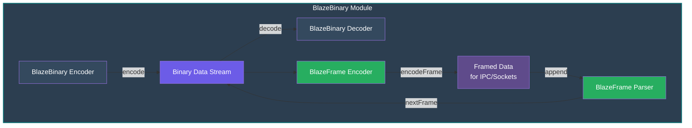

### Protocol Hierarchy

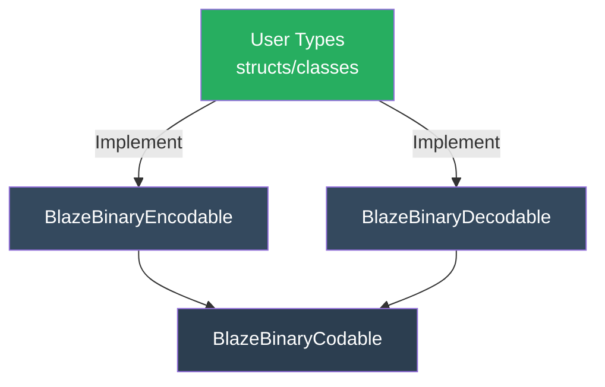

### Data Flow

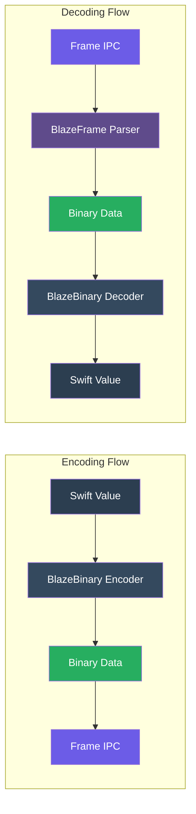

---

## Protocol Design

### Core Protocols

#### `BlazeBinaryEncodable`

Types that can be encoded to binary format must implement:

```swift
protocol BlazeBinaryEncodable {
    func blazeEncode(to encoder: BlazeBinaryEncoder) throws
}
```

**Design Philosophy**: 
- Explicit encoding order (no reflection)
- Field order is deterministic and controlled by the implementation
- No metadata overhead

#### `BlazeBinaryDecodable`

Types that can be decoded from binary format must implement:

```swift
protocol BlazeBinaryDecodable {
    init(from decoder: BlazeBinaryDecoder) throws
}
```

**Design Philosophy**:
- Mirror the encoding order exactly
- Fail fast on invalid data
- No default values or optional fallbacks

#### `BlazeBinaryCodable`

Convenience typealias for types that are both encodable and decodable:

```swift
typealias BlazeBinaryCodable = BlazeBinaryEncodable & BlazeBinaryDecodable
```

### Protocol Contract

**Critical Rule**: The order of fields in `blazeEncode(to:)` MUST exactly match the order of fields in `init(from:)`. This ensures deterministic round-trip encoding.

```swift
struct Example: BlazeBinaryCodable {
    var id: UUID
    var name: String
    var count: Int
    
    func blazeEncode(to encoder: BlazeBinaryEncoder) throws {
        encoder.encode(id.uuidString)  // 1. First field
        encoder.encode(name)            // 2. Second field
        encoder.encode(count)           // 3. Third field
    }
    
    init(from decoder: BlazeBinaryDecoder) throws {
        let idString = try decoder.decodeString()  // 1. Must match order
        guard let uuid = UUID(uuidString: idString) else {
            throw BlazeBinaryError.decodeFailed("Invalid UUID")
        }
        self.id = uuid
        self.name = try decoder.decodeString()     // 2. Must match order
        self.count = try decoder.decodeInt()       // 3. Must match order
    }
}
```

---

## Data Format Specifications

### Varint Encoding (LEB128)

Varints use LEB128 (Little-Endian Base 128) encoding. Each byte contains 7 bits of data and 1 continuation bit.

**Encoding Process**:


**Visual Representation**:

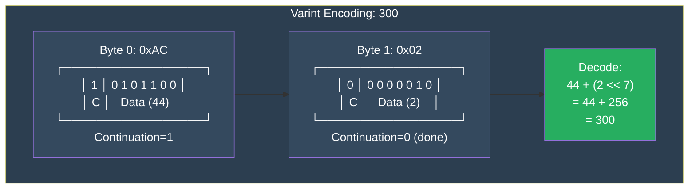

**Signed Integer Encoding (Zigzag)**:

Signed integers use zigzag encoding before varint encoding:

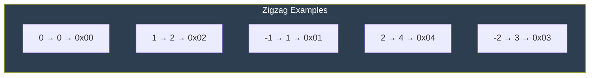

**Visual Representation**:


### Fixed-Width Little-Endian Encoding

**UInt32 Format**:

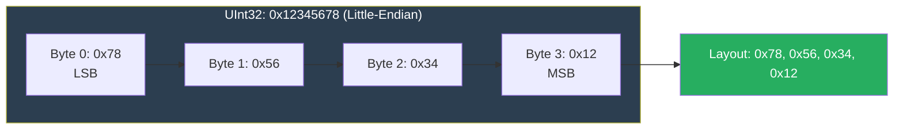

**UInt64 Format**:

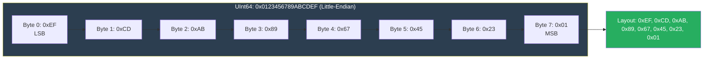

**Bool Format**:

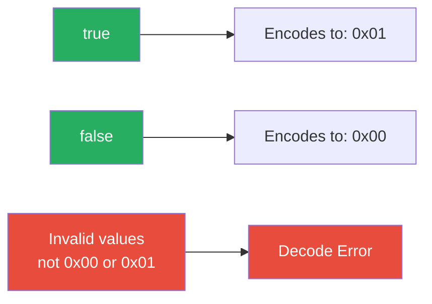

### Length-Prefixed Encoding

**Data Format**:

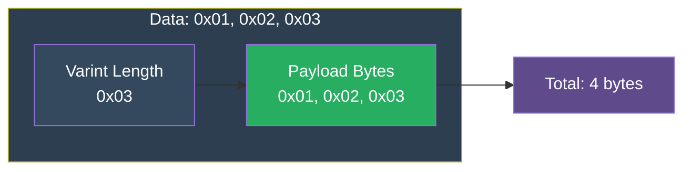

**String Format**:


### Array Encoding

**Format**:

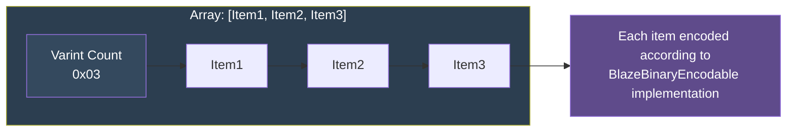

**Example: Array of Strings**:


### Composite Type Encoding

**Example: Struct Encoding**:
```swift
struct Person: BlazeBinaryCodable {
    var id: UUID
    var name: String
    var age: Int
}
```

**Binary Layout**:

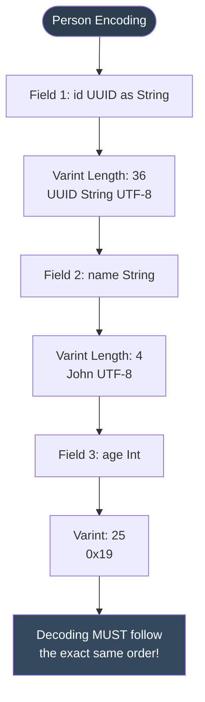

---

## Frame Format

> **Note**: See [FRAME_PROTOCOL.md](Docs/FRAME_PROTOCOL.md) for complete frame protocol specification, state machine, and incremental parsing details.

Frames are used for IPC (Inter-Process Communication) and socket-based protocols. They provide message boundaries and length validation.

### Frame Structure

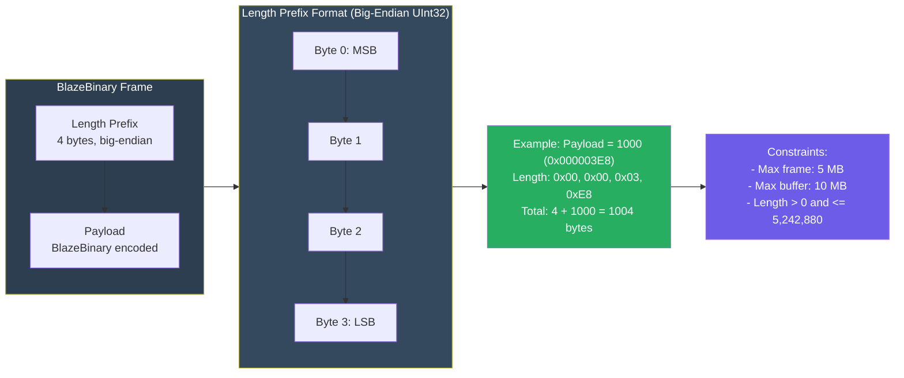

### Frame Encoding Example


### Streaming Frame Parsing

The `BlazeFrameParser` handles incremental frame parsing for network streams:

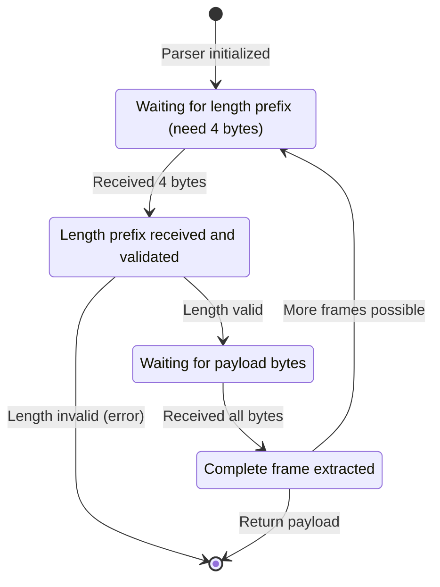

### Multiple Frames

When multiple frames are concatenated:

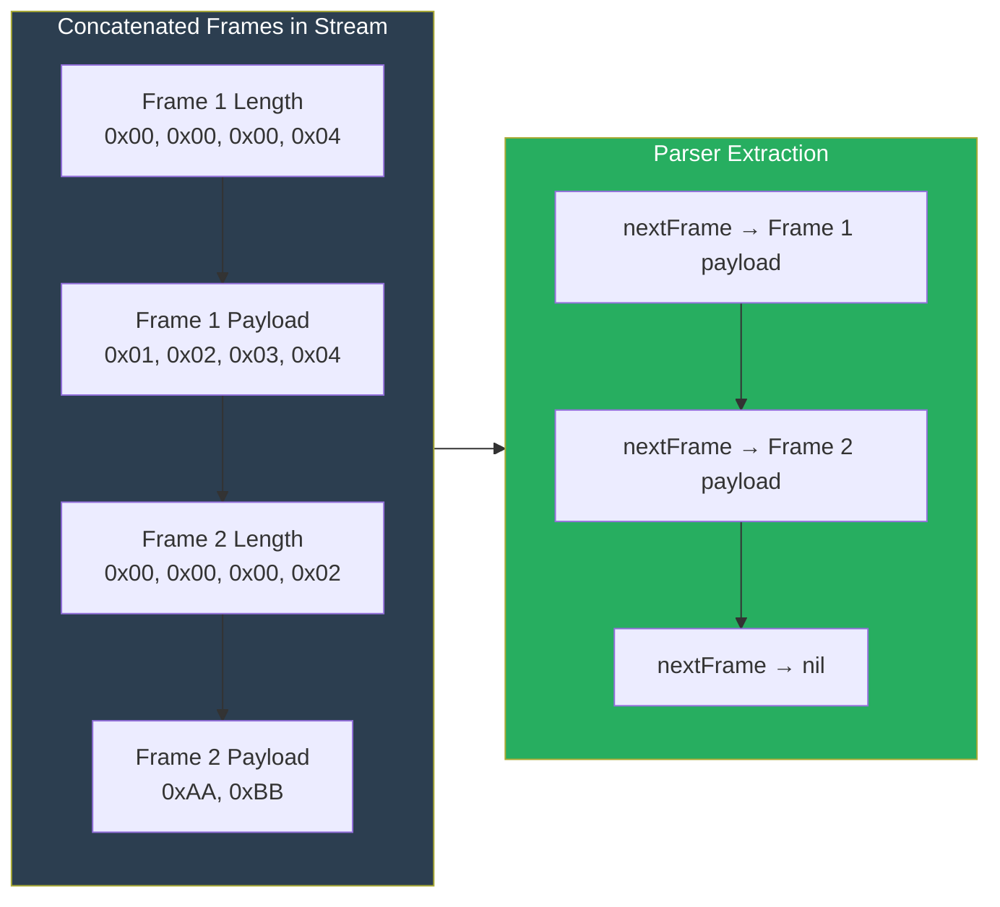

---

## Usage Guide

### Basic Encoding

```swift
import BlazeBinary

let encoder = BlazeBinaryEncoder()

encoder.encode(UInt32(42))
encoder.encode(UInt64(123456789))
encoder.encode(Int(-100))
encoder.encode(true)
encoder.encode("Hello, World!")
encoder.encode(Data([0x01, 0x02, 0x03]))

let data = encoder.encodedData()
```

### Basic Decoding

> **Note:** Decode values in the same order as encoding.

```swift
let decoder = BlazeBinaryDecoder(data: data)

let uint32 = try decoder.decodeUInt32()      // 42
let uint64 = try decoder.decodeUInt64()      // 123456789
let int = try decoder.decodeInt()            // -100
let bool = try decoder.decodeBool()          // true
let string = try decoder.decodeString()      // "Hello, World!"
let data = try decoder.decodeData()          // Data([0x01, 0x02, 0x03])
```

### Custom Types

> **Important:** Field encoding order must match decoding order exactly.

```swift
struct Person: BlazeBinaryCodable {
    var id: UUID
    var name: String
    var age: Int
    var active: Bool
    
    func blazeEncode(to encoder: BlazeBinaryEncoder) throws {
        encoder.encode(id.uuidString)
        encoder.encode(name)
        encoder.encode(age)
        encoder.encode(active)
    }
    
    init(from decoder: BlazeBinaryDecoder) throws {
        let idString = try decoder.decodeString()
        guard let uuid = UUID(uuidString: idString) else {
            throw BlazeBinaryError.decodeFailed("Invalid UUID")
        }
        self.id = uuid
        self.name = try decoder.decodeString()
        self.age = try decoder.decodeInt()
        self.active = try decoder.decodeBool()
    }
}
```

**Usage:**

```swift
let person = Person(id: UUID(), name: "Alice", age: 30, active: true)
let encoder = BlazeBinaryEncoder()
try encoder.encode(person)
let data = encoder.encodedData()

let decoder = BlazeBinaryDecoder(data: data)
let decoded = try decoder.decode(Person.self)
```

### Arrays

```swift
struct WorkStep: BlazeBinaryCodable {
    var description: String
    var completed: Bool
    
    func blazeEncode(to encoder: BlazeBinaryEncoder) throws {
        encoder.encode(description)
        encoder.encode(completed)
    }
    
    init(from decoder: BlazeBinaryDecoder) throws {
        self.description = try decoder.decodeString()
        self.completed = try decoder.decodeBool()
    }
}

struct WorkPlan: BlazeBinaryCodable {
    var steps: [WorkStep]
    
    func blazeEncode(to encoder: BlazeBinaryEncoder) throws {
        try encoder.encode(steps)
    }
    
    init(from decoder: BlazeBinaryDecoder) throws {
        self.steps = try decoder.decodeArray(WorkStep.self)
    }
}
```

### Frame Encoding (IPC/Sockets)

For network protocols, wrap payloads in frames:

```swift
let payload = Data([0x01, 0x02, 0x03, 0x04])
let frame = try BlazeFrameEncoder.encodeFrame(payload)
```

> Frame format: `[4-byte length prefix (big-endian)] + [payload]`

### Frame Parsing (Streaming)

Incremental parsing for network streams:

```swift
let parser = BlazeFrameParser()

try parser.append(receivedData1)
try parser.append(receivedData2)

while let payload = try parser.nextFrame() {
    let decoder = BlazeBinaryDecoder(data: payload)
    // Decode your message
}
```

> **Note:** `nextFrame()` returns `nil` when more data is needed.

### Complete Example: Network Protocol

**Server side (encoding):**

```swift
struct Message: BlazeBinaryCodable {
    var id: UUID
    var content: String
    
    func blazeEncode(to encoder: BlazeBinaryEncoder) throws {
        encoder.encode(id.uuidString)
        encoder.encode(content)
    }
    
    init(from decoder: BlazeBinaryDecoder) throws {
        let idString = try decoder.decodeString()
        guard let uuid = UUID(uuidString: idString) else {
            throw BlazeBinaryError.decodeFailed("Invalid UUID")
        }
        self.id = uuid
        self.content = try decoder.decodeString()
    }
}

let message = Message(id: UUID(), content: "Hello!")
let encoder = BlazeBinaryEncoder()
try encoder.encode(message)
let payload = encoder.encodedData()
let frame = try BlazeFrameEncoder.encodeFrame(payload)
sendToClient(frame)
```

**Client side (decoding):**

```swift
let parser = BlazeFrameParser()

try parser.append(receivedChunk1)
try parser.append(receivedChunk2)

if let payload = try parser.nextFrame() {
    let decoder = BlazeBinaryDecoder(data: payload)
    let message = try decoder.decode(Message.self)
    print("Received: \(message.content)")
}
```

---

## API Reference

### BlazeBinaryEncoder

#### Methods

- `encode(_ value: UInt32)` - Encode UInt32 (little-endian, 4 bytes)
- `encode(_ value: UInt64)` - Encode UInt64 (little-endian, 8 bytes)
- `encode(_ value: Int)` - Encode Int (varint with zigzag)
- `encode(_ value: Bool)` - Encode Bool (1 byte: 0x00 or 0x01)
- `encode(_ value: String)` - Encode String (varint length + UTF-8 bytes)
- `encode(_ value: Data)` - Encode Data (varint length + bytes)
- `encode<T: BlazeBinaryEncodable>(_ value: T)` - Encode custom type
- `encode<T: BlazeBinaryEncodable>(_ array: [T])` - Encode array
- `encodedData() -> Data` - Get encoded data

### BlazeBinaryDecoder

#### Methods

- `decodeUInt32() throws -> UInt32` - Decode UInt32
- `decodeUInt64() throws -> UInt64` - Decode UInt64
- `decodeInt() throws -> Int` - Decode Int (varint with zigzag)
- `decodeBool() throws -> Bool` - Decode Bool
- `decodeString() throws -> String` - Decode String
- `decodeData() throws -> Data` - Decode Data
- `decode<T: BlazeBinaryDecodable>(_ type: T.Type) throws -> T` - Decode custom type
- `decodeArray<T: BlazeBinaryDecodable>(_ type: T.Type) throws -> [T]` - Decode array

#### Initialization

- `init(data: Data, maxAllowedLength: Int = 10 * 1024 * 1024)` - Create decoder with optional max length

### BlazeFrameEncoder

#### Methods

- `static func encodeFrame(_ payload: Data) throws -> Data` - Encode frame
- `static let maxFrameSize: Int` - Maximum frame size (5 MB)

### BlazeFrameParser

#### Methods

- `func append(_ data: Data) throws` - Append data to buffer
- `func nextFrame() throws -> Data?` - Extract next complete frame (returns nil if more data needed)
- `func clear()` - Clear internal buffer
- `var bufferSize: Int` - Current buffer size

#### Initialization

- `init(maxFrameSize: Int = BlazeFrameEncoder.maxFrameSize)` - Create parser

### BlazeBinaryError

Error cases:

- `.truncated` - Data is incomplete
- `.invalidVarint` - Invalid varint encoding
- `.invalidFrameLength` - Invalid frame length prefix
- `.oversizedFrame` - Frame exceeds maximum size
- `.decodeFailed(String)` - Decoding failed with reason
- `.needMoreData` - More data needed (used internally)

---

## Safety & Validation

### Bounds Checking

All decoding operations perform strict bounds checking:

```swift
let decoder = BlazeBinaryDecoder(data: Data([0x01, 0x02]))
let value = try decoder.decodeUInt32()  // Throws: BlazeBinaryError.truncated
```

> **Error:** Needs 4 bytes, only 2 available.

### Length Validation

Variable-length fields are validated against `maxAllowedLength`:

```swift
let decoder = BlazeBinaryDecoder(data: hugeData, maxAllowedLength: 1024)
let data = try decoder.decodeData()  // Throws if length > 1024
```

> Default max: 10 MB

### Frame Size Limits

- **Max Frame Size**: 5 MB (prevents memory exhaustion)
- **Max Buffer Size**: 10 MB (prevents buffer overflow attacks)

```swift
let hugePayload = Data(repeating: 0, count: 6 * 1024 * 1024)
let frame = try BlazeFrameEncoder.encodeFrame(hugePayload)  // Throws: oversizedFrame
```

> **Limit:** 6 MB exceeds 5 MB maximum frame size.

### Invalid Data Rejection

- Invalid varints (too many bytes, overflow)
- Invalid bool values (not 0x00 or 0x01)
- Invalid UTF-8 sequences
- Invalid frame lengths (0 or > maxFrameSize)

---

## Performance Considerations

### Encoding Performance

- **Varints**: O(log n) where n is the value
- **Fixed-width**: O(1) constant time
- **Arrays**: O(n) where n is array length
- **Strings**: O(n) where n is UTF-8 byte count

### Memory Usage

- **Encoder**: Grows dynamically, no pre-allocation
- **Decoder**: Zero-copy where possible (uses Data slices)
- **Frame Parser**: Buffers data until frames are complete

### Best Practices

1. **Reuse encoders/decoders** when possible
2. **Pre-allocate Data capacity** if you know the size
3. **Use frame parsing** for streaming to avoid loading entire messages
4. **Set appropriate maxAllowedLength** based on your use case

---

## Related Documentation

- **[SPECIFICATION.md](Docs/SPECIFICATION.md)** - Complete encoding format specification
- **[FRAME_PROTOCOL.md](Docs/FRAME_PROTOCOL.md)** - Frame format and incremental parsing
- **[ProtocolExamples.md](Docs/ProtocolExamples.md)** - Usage examples and patterns
- **[ARCHITECTURE.md](Docs/ARCHITECTURE.md)** - System architecture
- **[THREAT_MODEL.md](Docs/THREAT_MODEL.md)** - Security analysis
- **[ProductionSafetyProfile.md](Docs/ProductionSafetyProfile.md)** - Safety guarantees
- **[FaultToleranceChecklist.md](Docs/FaultToleranceChecklist.md)** - Engineering checklist

## Technical Details

### Encoding Guarantees

- **Deterministic**: Same input → same bytes (verified with 100+ iteration tests)
- **No Metadata**: No field names, types, or schema information encoded
- **Field Order**: Fields encoded in exact order specified by `blazeEncode(to:)`
- **Round-Trip**: For any `T: BlazeBinaryCodable`, `decode(encode(v)) == v`

### Size Limits

- **Frame Size**: 5 MB (5,242,880 bytes) - enforced in `BlazeFrameEncoder.encodeFrame()`
- **Buffer Size**: 10 MB (10,485,760 bytes) - enforced in `BlazeFrameParser.append()`
- **Variable-Length Fields**: 10 MB default (configurable via `BlazeBinaryDecoder.init(maxAllowedLength:)`)

All limits are validated before allocation or processing. Exceeding limits throws `BlazeBinaryError.oversizedFrame` or `BlazeBinaryError.decodeFailed`.

### Error Handling

All errors are `BlazeBinaryError` enum cases. The decoder fails fast - on error, decoding stops immediately and no partial state is returned. See [ProductionSafetyProfile.md](Docs/ProductionSafetyProfile.md) for complete error model.

### Performance

- **Hot Paths**: Marked with `@inlinable` for compiler optimization
- **Zero-Copy**: Data decoding returns slices when possible
- **Complexity**: O(1) fixed-width, O(log n) varints, O(n) length-prefixed
- **Allocations**: Minimal, bounded by size limits

## License

BlazeBinary is licensed under the **MIT License**.

Copyright (c) 2025 Michael Danylchuk

Permission is hereby granted, free of charge, to any person obtaining a copy of this software and associated documentation files (the "Software"), to deal in the Software without restriction, including without limitation the rights to use, copy, modify, merge, publish, distribute, sublicense, and/or sell copies of the Software, and to permit persons to whom the Software is furnished to do so, subject to the following conditions:

The above copyright notice and this permission notice shall be included in all copies or substantial portions of the Software.

THE SOFTWARE IS PROVIDED "AS IS", WITHOUT WARRANTY OF ANY KIND, EXPRESS OR IMPLIED, INCLUDING BUT NOT LIMITED TO THE WARRANTIES OF MERCHANTABILITY, FITNESS FOR A PARTICULAR PURPOSE AND NONINFRINGEMENT. IN NO EVENT SHALL THE AUTHORS OR COPYRIGHT HOLDERS BE LIABLE FOR ANY CLAIM, DAMAGES OR OTHER LIABILITY, WHETHER IN AN ACTION OF CONTRACT, TORT OR OTHERWISE, ARISING FROM, OUT OF OR IN CONNECTION WITH THE SOFTWARE OR THE USE OR OTHER DEALINGS IN THE SOFTWARE.

See the [LICENSE](LICENSE) file for the full license text.

## Contributing

We welcome contributions to BlazeBinary! Please see our [Contributing Guidelines](CONTRIBUTING.md) for details on:

- How to report issues
- How to submit pull requests
- Code style and standards
- Testing requirements
- Documentation guidelines

### Quick Start for Contributors

1. **Fork the repository**
2. **Create a feature branch**: `git checkout -b feature/your-feature-name`
3. **Make your changes** and add tests
4. **Run tests**: `swift test`
5. **Update documentation** if needed
6. **Submit a pull request**

For detailed guidelines, please read [CONTRIBUTING.md](CONTRIBUTING.md).

