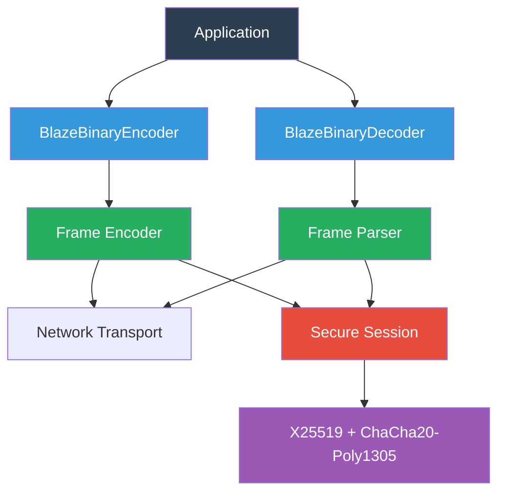

# BlazeBinary

**Protocol v1.3.0** - Production-Ready Release

A production-grade, deterministic binary encoding/decoding library for Swift. BlazeBinary provides efficient, safe, and predictable serialization without dependencies on JSON, CBOR, or PropertyList formats.

**Status**: Protocol v1.3 is **FROZEN** and ready for production use.

[](https://swift.org)
[](https://swift.org)
[](LICENSE)

## Features

- **Deterministic Encoding**: Same input always produces identical bytes
- **High Performance**: 4M+ ops/sec for encoding, zero-copy decoding
- **Type-Safe**: Protocol-based design with compile-time type checking
- **Secure Sessions**: Optional X25519 key exchange + ChaCha20-Poly1305 encryption
- **Frame Protocol**: Incremental parsing for network transport
- **Production-Ready**: Comprehensive tests, fuzzing, and benchmarks

## Quick Start

### Installation

Add BlazeBinary to your `Package.swift`:

```swift
dependencies: [
    .package(url: "https://github.com/yourusername/BlazeBinary.git", from: "1.3.0")
]
```

### Basic Usage

```swift
import BlazeBinary

// Define a type
struct Message: BlazeBinaryCodable {
    var id: String
    var text: String
    var count: Int
    
    func blazeEncode(to encoder: BlazeBinaryEncoder) throws {
        encoder.encode(id)
        encoder.encode(text)
        encoder.encode(count)
    }
    
    init(from decoder: BlazeBinaryDecoder) throws {
        self.id = try decoder.decodeString()
        self.text = try decoder.decodeString()
        self.count = try decoder.decodeInt()
    }
}

// Encode
let message = Message(id: "abc123", text: "Hello", count: 42)
let encoder = BlazeBinaryEncoder()
try encoder.encode(message)
let binaryData = encoder.encodedData()

// Frame for transport
let frame = try BlazeFrameEncoder.encodeFrame(binaryData)

// Decode
let parser = BlazeFrameParser()
try parser.append(frame)
if let payload = try parser.nextFrame() {
    let decoder = BlazeBinaryDecoder(data: payload)
    let decoded = try decoder.decode(Message.self)
    print(decoded.text) // "Hello"
}
```

## Why BlazeBinary?

### Deterministic by Design

Same input always produces identical bytes, enabling:
- Reliable content addressing and hashing
- Cryptographic signatures and message authentication
- Deterministic testing and binary diffs

### Production-Grade Performance

- **4.1M ops/sec** for varint encoding (p50: 0.24 μs)
- **275K ops/sec** for data encoding (1KB, p50: 3.64 μs)
- **Zero-copy decoding** for Data fields
- **85% smaller** payloads than JSON

### Safety First

- Strict bounds checking prevents buffer overflows
- Size limits prevent memory exhaustion (5MB frames, 10MB buffers)
- Fail-fast error handling with clear error types
- No undefined behavior or crashes

## Architecture



## Documentation

Complete documentation is available in [Docs/INDEX.md](Docs/INDEX.md), including:

- **[SPECIFICATION_v1.3.md](Docs/Core/SPECIFICATION_v1.3.md)** - **FROZEN** Protocol v1.3 specification
- **[BENCHMARKS.md](Docs/Performance/BENCHMARKS.md)** - Performance benchmarks and comparisons
- **[FUZZING.md](Docs/Performance/FUZZING.md)** - Fuzzing infrastructure and strategies
- **[PERFORMANCE_TRACKING.md](Docs/Performance/PERFORMANCE_TRACKING.md)** - Performance tracking infrastructure
- **[FAILURE_SEMANTICS.md](Docs/Core/FAILURE_SEMANTICS.md)** - Error handling and failure modes
- **[API_STABILITY.md](Docs/Core/API_STABILITY.md)** - API stability guarantees

See [Docs/INDEX.md](Docs/INDEX.md) for the complete documentation index.

## Performance

### Encoding Throughput

| Operation | Throughput | p50 Latency |
|-----------|------------|-------------|
| Varint encode (small) | 4.1M ops/sec | 0.24 μs |
| Varint decode (small) | 4.4M ops/sec | 0.23 μs |
| Data encode (1KB) | 275K ops/sec | 3.64 μs |
| Data decode (1KB) | 318K ops/sec | 3.14 μs |
| Frame encode (1KB) | 206K ops/sec | 4.85 μs |
| Frame decode (1KB) | 180K ops/sec | 5.56 μs |

### Encryption Performance

| Operation | Throughput | p50 Latency |
|-----------|------------|-------------|
| AEAD encrypt (1KB) | 12K ops/sec | 83 μs |
| AEAD decrypt (1KB) | 15K ops/sec | 67 μs |

For detailed benchmarks, see [BENCHMARKS.md](Docs/Performance/BENCHMARKS.md).

## Secure Session Mode

BlazeBinary includes optional secure session support with:

- **X25519** key exchange for perfect forward secrecy
- **HKDF-SHA256** key derivation
- **ChaCha20-Poly1305** authenticated encryption
- **Replay protection** with strict nonce management

```swift
// Client handshake
var clientHandshake = BlazeSecureHandshake(role: .client)
let clientHello = try clientHandshake.makeOutboundMessage()

// Server handshake
var serverHandshake = BlazeSecureHandshake(role: .server)
let serverHello = try serverHandshake.processInboundMessage(clientHello)

// Derive session keys
let clientKeys = try clientHandshake.processInboundMessage(serverHello)
var clientSession = BlazeSecureSession(keyMaterial: clientKeys)

// Encrypt frame
let plaintext = Data("Secret message".utf8)
let encrypted = try clientSession.makeEncryptedFrame(from: plaintext)
```

See [ENCRYPTION.md](Docs/Crypto/ENCRYPTION.md) for complete details.

## Requirements

- **Swift**: 5.9+
- **Platforms**: macOS 12+, iOS 15+
- **Dependencies**: swift-crypto (for secure sessions)

## Contributing

We welcome contributions! Please see [CONTRIBUTING.md](CONTRIBUTING.md) for guidelines.

### Development Setup

```bash
# Clone the repository
git clone https://github.com/yourusername/BlazeBinary.git
cd BlazeBinary

# Build
swift build

# Run tests
swift test

# Run benchmarks
swift run BlazeBinaryBenchmarks
```

## Security

For security concerns, please see [SECURITY.md](SECURITY.md).

BlazeBinary provides:
- Memory safety through strict bounds checking
- Deterministic encoding for cryptographic signatures
- Optional secure sessions with authenticated encryption
- Comprehensive security review (see [SECURITY_REVIEW.md](Docs/Security/SECURITY_REVIEW.md))

## License

BlazeBinary is released under the MIT License. See [LICENSE](LICENSE) for details.

## Status

**Protocol v1.3.0** is **FROZEN** and production-ready. The specification will not change except for bug fixes in patch versions (v1.3.x).

## Related Projects

- Part of the Blaze ecosystem
- Designed for high-performance distributed systems
- Compatible with Swift concurrency and async/await

## Support

- **Documentation**: [Docs/INDEX.md](Docs/INDEX.md)
- **Issues**: [Issues.md](Issues.md)
- **Changelog**: [CHANGELOG.md](CHANGELOG.md)

---

**BlazeBinary Protocol v1.3.0** - Production-Ready Release
